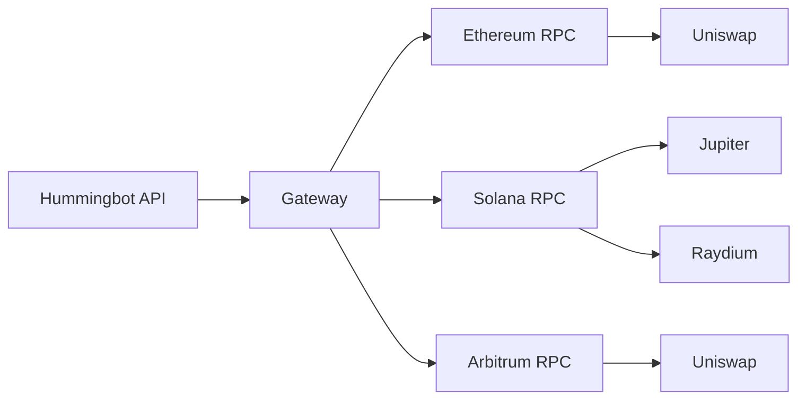

**Gateway** is DEX middleware that enables Hummingbot API to trade on decentralized exchanges. It provides a standardized interface to swap tokens, provide liquidity, and interact with DeFi protocols across multiple blockchains.

## What is Gateway?

Gateway is a separate service that:

- Connects to blockchain RPCs (Ethereum, Solana, etc.)
- Manages wallet keys and transaction signing
- Provides unified API for different DEX protocols
- Handles gas estimation and transaction submission



## Supported Protocols

### AMM Swaps

| Protocol | Chains |
|----------|--------|
| **Uniswap** | Ethereum, Arbitrum, Base, Polygon, Optimism |
| **Jupiter** | Solana |
| **Raydium** | Solana |
| **PancakeSwap** | BSC, Ethereum |
| **SushiSwap** | Ethereum, Arbitrum |
| **Orca** | Solana |
| **Curve** | Ethereum |
| **Balancer** | Ethereum, Arbitrum |

### CLMM (Concentrated Liquidity)

| Protocol | Chains |
|----------|--------|
| **Uniswap V3** | Ethereum, Arbitrum, Base, Polygon |
| **Raydium CLMM** | Solana |
| **Orca Whirlpools** | Solana |
| **PancakeSwap V3** | BSC, Ethereum |

### Supported Chains

| Chain | Type | RPC Required |
|-------|------|--------------|
| Ethereum | EVM | Yes |
| Arbitrum | EVM | Yes |
| Base | EVM | Yes |
| Polygon | EVM | Yes |
| Optimism | EVM | Yes |
| BSC | EVM | Yes |
| Solana | SVM | Yes |

## How Hummingbot API Uses Gateway

### Swaps

Execute token swaps via the `/gateway/swap` endpoints:

```bash
# Get a swap quote
curl -u YOUR_USERNAME:YOUR_PASSWORD -X POST http://localhost:8000/gateway/swap/quote \
  -H "Content-Type: application/json" \
  -d '{
    "connector": "jupiter/router",
    "network": "solana-mainnet-beta",
    "trading_pair": "SOL-USDC",
    "side": "SELL",
    "amount": 1.0
  }'

# Execute the swap (same fields; wallet_address is optional — the default wallet is used)
curl -u YOUR_USERNAME:YOUR_PASSWORD -X POST http://localhost:8000/gateway/swap/execute \
  -H "Content-Type: application/json" \
  -d '{
    "connector": "jupiter/router",
    "network": "solana-mainnet-beta",
    "trading_pair": "SOL-USDC",
    "side": "SELL",
    "amount": 1.0,
    "slippage_pct": 1.0
  }'
```

Past swaps are searchable via `POST /gateway/swaps/search`, and a transaction's status via `GET /gateway/swaps/{transaction_hash}/status`.

### Liquidity Provision

Manage CLMM positions via `/gateway/clmm` endpoints:

```bash
# List pools for a connector
curl -u YOUR_USERNAME:YOUR_PASSWORD \
  "http://localhost:8000/gateway/clmm/pools?connector=raydium/clmm&search_term=SOL-USDC"

# Get one pool's live state
curl -u YOUR_USERNAME:YOUR_PASSWORD \
  "http://localhost:8000/gateway/clmm/pool-info?connector=raydium/clmm&network=solana-mainnet-beta&pool_address=POOL_ADDRESS"

# Add liquidity to an existing position (open a new one with /gateway/clmm/open)
curl -u YOUR_USERNAME:YOUR_PASSWORD -X POST http://localhost:8000/gateway/clmm/add \
  -H "Content-Type: application/json" \
  -d '{
    "connector": "raydium/clmm",
    "network": "solana-mainnet-beta",
    "position_address": "position-address",
    "base_token_amount": 1.0,
    "quote_token_amount": 150.0
  }'
```

Full-range AMM liquidity has its own parallel router under `/gateway/amm` (pool-info, quote-liquidity, add/remove-liquidity).

## Setup

### 1. Configure Gateway

Gateway's per-network configuration (RPC endpoints, tokens, pools) is readable and writable through the API:

```bash
# List networks Gateway knows about
curl -u YOUR_USERNAME:YOUR_PASSWORD http://localhost:8000/gateway/networks

# Read one network's config (e.g. its RPC endpoint)
curl -u YOUR_USERNAME:YOUR_PASSWORD http://localhost:8000/gateway/networks/solana-mainnet-beta
```

Updating a network's config is a `POST` to the same path; tokens and pools have their own subpaths (`/gateway/networks/{network_id}/tokens`, `/gateway/networks/{network_id}/pools`).

### 2. Add Wallets

Add wallet credentials via Condor or API:

**Telegram:**
```
/gateway → Add Wallet → Solana → Enter private key
```

**API:**
```bash
curl -u YOUR_USERNAME:YOUR_PASSWORD -X POST http://localhost:8000/accounts/gateway/add-wallet \
  -H "Content-Type: application/json" \
  -d '{
    "chain": "solana",
    "private_key": "your-private-key"
  }'
```

### 3. Verify Connection

Check Gateway status:

```bash
curl -u YOUR_USERNAME:YOUR_PASSWORD http://localhost:8000/gateway/status
```

## Gateway vs CEX Connectors

| Aspect | CEX Connectors | Gateway |
|--------|----------------|---------|
| **Custody** | Exchange holds funds | You hold keys |
| **Speed** | Fast (centralized) | Slower (blockchain) |
| **Fees** | Trading fees | Gas + trading fees |
| **Availability** | Exchange uptime | Blockchain uptime |
| **Privacy** | KYC required | Permissionless |

## Resources

<CardGroup cols={2}>
  <Card title="Gateway GitHub" icon="github" href="https://github.com/hummingbot/gateway">
    Gateway source code
  </Card>
  <Card title="Gateway Docs" icon="book" href="https://hummingbot.org/gateway/">
    Full Gateway documentation
  </Card>
</CardGroup>
