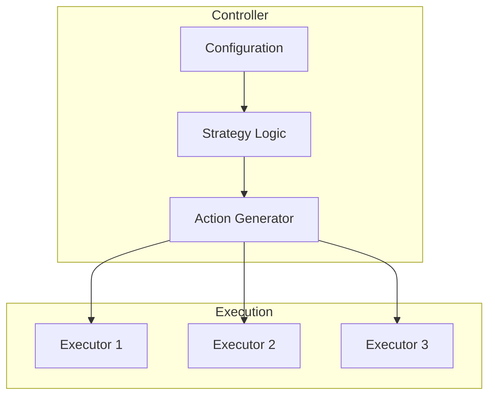
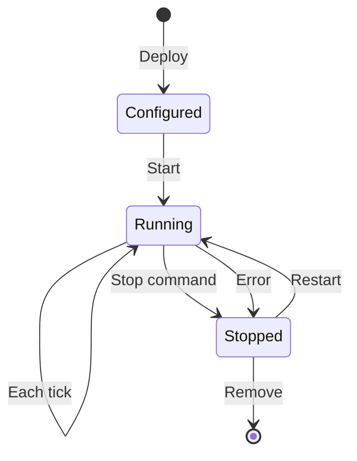

**Controllers** are modular strategy components in Hummingbot's V2 framework. They provide structured approaches to market making, directional trading, and other algorithmic strategies.

## Controller Architecture



Controllers:
- Define strategy parameters via configuration
- Implement trading logic that runs each tick
- Generate executor actions (create, stop, modify)
- Track overall strategy performance

## Available Controllers

List controllers via API:

```bash
curl -u admin:admin http://localhost:8000/controllers
```

### Common Controller Types

| Controller | Description |
|------------|-------------|
| `directional_trading` | Trend-following with position management |
| `market_making_v2` | Two-sided liquidity provision |
| `grid_trading` | Multi-level buy/sell orders |
| `arbitrage` | Cross-exchange price differences |

## Configuration Schema

Get configuration options for a controller:

```bash
curl -u admin:admin http://localhost:8000/controllers/directional_trading/config
```

Response includes all configurable parameters with types and defaults.

## Example: Directional Trading

```yaml
# config/directional_trading.yml
controller_name: directional_trading
connector_name: binance_perpetual
trading_pair: SOL-USDT

# Entry parameters
position_size_quote: 100
max_executors_per_side: 3

# Triple barrier
take_profit: 0.02
stop_loss: 0.01
time_limit: 3600
trailing_stop_activation: 0.01
trailing_stop_delta: 0.005

# Signal parameters (customizable)
signal_source: technical_analysis
rsi_period: 14
rsi_overbought: 70
rsi_oversold: 30
```

## Example: Market Making

```yaml
# config/market_making.yml
controller_name: market_making_v2
connector_name: binance
trading_pair: BTC-USDT

# Spread parameters
bid_spread: 0.001
ask_spread: 0.001
order_amount: 0.01
order_levels: 3
order_level_spread: 0.0005

# Order management
order_refresh_time: 15
max_order_age: 300

# Inventory management
inventory_target_base_pct: 50
inventory_range_multiplier: 1.5
```

## Deploying a Controller

**Via Telegram**:
1. `/bots` → Create New Bot
2. Select **Controller**
3. Choose the controller type
4. Configure parameters
5. Start the bot

**Via API**:

```bash
curl -u admin:admin -X POST http://localhost:8000/bot-orchestration/deploy \
  -H "Content-Type: application/json" \
  -d '{
    "bot_name": "sol-directional",
    "controller_name": "directional_trading",
    "config": {
      "connector_name": "binance_perpetual",
      "trading_pair": "SOL-USDT",
      "position_size_quote": 100,
      "take_profit": 0.02,
      "stop_loss": 0.01
    }
  }'
```

## Controller Lifecycle



Each tick, the controller:
1. Reads market data
2. Evaluates strategy conditions
3. Generates executor actions
4. Manages existing executors

## Custom Controllers

Create custom controllers by extending `ControllerBase`:

```python
from hummingbot.strategy_v2.controllers import ControllerBase

class MyCustomController(ControllerBase):
    def __init__(self, config):
        super().__init__(config)
        # Initialize strategy state

    def determine_executor_actions(self):
        # Return list of CreateExecutorAction or StopExecutorAction
        actions = []

        if self.should_open_long():
            actions.append(CreateExecutorAction(
                executor_type="position_executor",
                config=self.build_long_config()
            ))

        return actions
```

<Info>
See [Hummingbot V2 documentation](https://hummingbot.org/v2-strategies/) for detailed controller development guides.
</Info>
