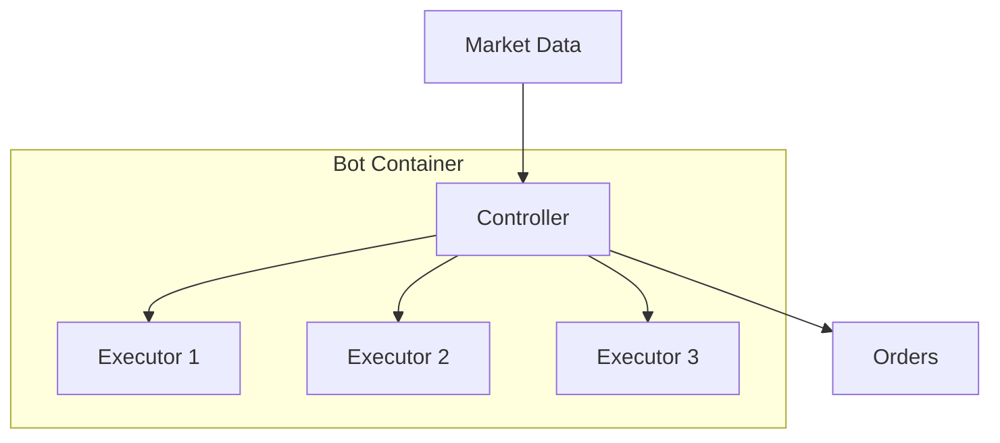

**Controllers** are V2 strategy components that implement algorithmic trading logic. They run inside bot containers and manage complex, multi-step trading strategies.

## What Are Controllers?

Controllers are Python classes that:
- Define trading strategy logic
- Manage multiple executors
- Handle market data processing
- Implement risk management



## Built-in Controllers

| Controller | Description |
|------------|-------------|
| `directional_trading` | Trend-following with configurable indicators |
| `market_making` | Two-sided liquidity provision |
| `grid_trading` | Grid of buy/sell orders at price levels |
| `arbitrage` | Cross-exchange price arbitrage |
| `dca` | Dollar-cost averaging strategy |

## Controller Structure

```python
# controllers/directional_trading.py
from hummingbot.strategy_v2.controllers import ControllerBase

class DirectionalTradingController(ControllerBase):
    """
    Directional trading strategy using technical indicators.
    """

    def __init__(self, config: DirectionalTradingConfig):
        super().__init__(config)
        self.config = config

    async def on_tick(self):
        """Called every tick interval."""
        # Get market data
        candles = await self.get_candles()

        # Analyze trend
        trend = self.analyze_trend(candles)

        # Manage positions based on trend
        if trend == "bullish" and not self.has_long_position():
            await self.open_long()
        elif trend == "bearish" and not self.has_short_position():
            await self.open_short()

    def analyze_trend(self, candles):
        """Determine market trend from candle data."""
        # Calculate indicators
        ema_fast = self.calculate_ema(candles, self.config.ema_fast)
        ema_slow = self.calculate_ema(candles, self.config.ema_slow)

        if ema_fast > ema_slow:
            return "bullish"
        elif ema_fast < ema_slow:
            return "bearish"
        return "neutral"
```

## Controller Configuration

Controllers are configured via YAML:

```yaml
# config/directional_trading.yml
controller_name: directional_trading
controller_type: directional_trading

# Exchange settings
connector_name: binance_perpetual
trading_pair: SOL-USDT

# Strategy parameters
ema_fast: 7
ema_slow: 25
take_profit: 0.02  # 2%
stop_loss: 0.01    # 1%

# Position sizing
order_amount: 10
max_executors: 3

# Risk limits
max_loss_per_day: 100
```

## Deploying a Controller

### Via Telegram

```
/bots → Create New Bot → Controller
→ Select: directional_trading
→ Configure parameters
→ Deploy
```

### Via API

```bash
curl -u admin:admin -X POST http://localhost:8000/bot-orchestration/deploy \
  -H "Content-Type: application/json" \
  -d '{
    "bot_name": "sol-directional",
    "controller_name": "directional_trading",
    "config": {
      "connector_name": "binance_perpetual",
      "trading_pair": "SOL-USDT",
      "ema_fast": 7,
      "ema_slow": 25
    }
  }'
```

## Controller Lifecycle

1. **Initialize**: Load configuration, connect to exchange
2. **Start**: Begin tick loop, subscribe to market data
3. **Run**: Execute strategy logic each tick
4. **Stop**: Close positions (optional), clean up

```python
# Lifecycle hooks
async def on_start(self):
    """Called when controller starts."""
    self.logger.info("Starting directional trading...")

async def on_stop(self):
    """Called when controller stops."""
    await self.close_all_positions()
    self.logger.info("Stopped directional trading")
```

## Creating Custom Controllers

1. Create a new Python file in `controllers/`
2. Inherit from `ControllerBase`
3. Implement required methods
4. Register the controller

```python
# controllers/my_strategy.py
from hummingbot.strategy_v2.controllers import ControllerBase
from hummingbot.strategy_v2.models import ControllerConfig

class MyStrategyConfig(ControllerConfig):
    controller_name: str = "my_strategy"
    # Add custom config fields

class MyStrategyController(ControllerBase):
    def __init__(self, config: MyStrategyConfig):
        super().__init__(config)

    async def on_tick(self):
        # Your strategy logic here
        pass
```

## Monitoring Controllers

View controller status and performance:

```bash
# Get controller status
curl -u admin:admin http://localhost:8000/bot-orchestration/{bot_id}/controller/status

# Get controller metrics
curl -u admin:admin http://localhost:8000/bot-orchestration/{bot_id}/controller/metrics
```
