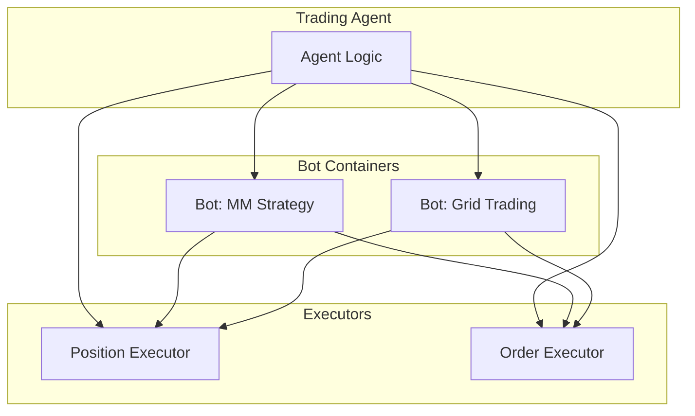

**Bots** are Docker containers running Hummingbot instances for long-running automation tasks. They execute [Scripts](/bots/scripts) for simpler tasks or [Controllers](/bots/controllers) for algorithmic trading strategies.

## Bots vs Executors

| Aspect | Executors | Bots |
|--------|-----------|------|
| **Lifecycle** | Short-lived (minutes to hours) | Long-running (days to weeks) |
| **Scope** | Single operation | Complex strategies |
| **Control** | Agent-controlled | Autonomous or supervised |
| **Use Case** | Individual trades | Continuous market making |



## When to Use Bots

| Scenario | Use | Reason |
|----------|-----|--------|
| Single directional trade | Executor | Short-lived, defined outcome |
| Continuous market making | Bot | Long-running, complex logic |
| One-time swap | Executor | Simple, immediate |
| Multi-leg arbitrage | Bot | Requires coordination |
| LP position with time limit | Executor | Self-contained lifecycle |
| 24/7 grid trading | Bot | Persistent, adaptive |

## Bot Lifecycle

### Creation

Create a bot via Telegram or API:

**Telegram**:
```
/bots → Create New Bot → Select Script/Controller
```

**API**:
```bash
curl -u admin:admin -X POST http://localhost:8000/bot-orchestration/deploy \
  -H "Content-Type: application/json" \
  -d '{
    "bot_name": "my-market-maker",
    "controller_name": "directional_trading",
    "config": {
      "exchange": "binance_perpetual",
      "trading_pair": "SOL-USDT"
    }
  }'
```

### Starting and Stopping

**Telegram**:
```
/bots → Select bot → Start/Stop
```

**API**:
```bash
# Start
curl -u admin:admin -X POST http://localhost:8000/bot-orchestration/{bot_id}/start

# Stop
curl -u admin:admin -X POST http://localhost:8000/bot-orchestration/{bot_id}/stop
```

### Monitoring

**Telegram**: `/bots` shows:
- Bot status (running/stopped)
- Uptime and resource usage
- Recent P&L
- Active orders and positions

**API**:
```bash
curl -u admin:admin http://localhost:8000/bot-orchestration/status
```

### Logs

**Telegram**:
```
/bots → Select bot → View Logs
```

**API**:
```bash
curl -u admin:admin http://localhost:8000/bot-orchestration/{bot_id}/logs
```

## Bot Configuration

Bots are configured via YAML files:

```yaml
# config/mm_strategy.yml
exchange: binance_perpetual
trading_pair: SOL-USDT

# Strategy parameters
bid_spread: 0.001
ask_spread: 0.001
order_amount: 10
order_refresh_time: 15

# Risk management
max_order_age: 300
inventory_target_base_pct: 50
```

## Container Isolation

Each bot runs in an isolated Docker container:

- Separate filesystem
- Independent network
- Own log streams
- Can be started/stopped individually

```bash
# List bot containers
docker ps --filter "name=hummingbot"

# View container logs
docker logs hummingbot-my-market-maker
```

## Integration with Agents

Agents can deploy and manage bots programmatically:

```python
# Agent deploys a bot
result = await mcp_tools.manage_bots(
    action="create",
    bot_type="controller",
    controller_name="directional_trading",
    config={
        "exchange": "binance_perpetual",
        "trading_pair": "ETH-USDT",
    }
)

# Agent monitors bot
status = await mcp_tools.get_bot_status(bot_id=result["bot_id"])
```
