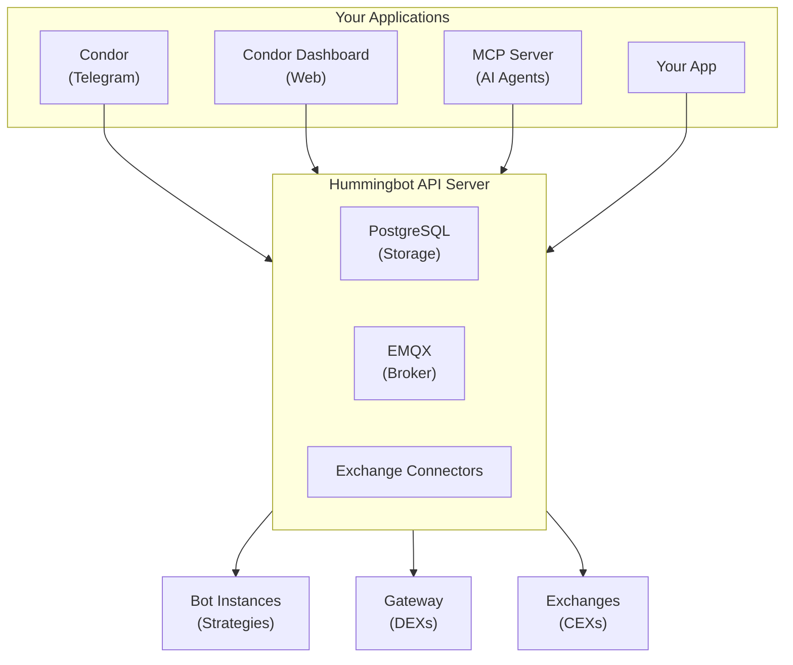

Hummingbot API is a RESTful API server that provides full access to all [Hummingbot](https://hummingbot.org) exchange connectors and trading strategies. Build any trading application on top of it—from simple portfolio trackers to sophisticated algorithmic trading systems.

[Condor](/docs/condor/overview) (Telegram) and [Condor Dashboard](/docs/dashboard/overview) (web) are reference clients that demonstrate how to build applications using the API.

## What You Can Build

<CardGroup cols={2}>
  <Card title="Portfolio Trackers" icon="chart-pie">
    Aggregate balances and track PnL across multiple exchanges in real-time
  </Card>
  <Card title="Market Making Systems" icon="robot">
    Deploy and orchestrate Hummingbot instances running automated strategies
  </Card>
  <Card title="Smart Order Routers" icon="arrow-right-arrow-left">
    Execute orders, manage positions, and track fills across CEX and DEX markets
  </Card>
  <Card title="AI Trading Agents" icon="microchip-ai">
    Integrate with Claude, ChatGPT, or Gemini via the Model Context Protocol (MCP)
  </Card>
</CardGroup>

## Architecture

## API Capabilities

| Category | Endpoints | Description |
|----------|-----------|-------------|
| **Accounts** | `/accounts` | Manage exchange credentials and trading accounts |
| **Portfolio** | `/portfolio` | Track balances, PnL, and portfolio distribution |
| **Trading** | `/trading` | Place orders, manage positions, view trade history |
| **Market Data** | `/market-data` | Prices, order books, candles, funding rates |
| **Bot Orchestration** | `/bot-orchestration` | Deploy and control Hummingbot trading bots |
| **Connectors** | `/connectors` | Access 50+ CEX connectors and trading rules |
| **Gateway** | `/gateway` | DEX swaps and liquidity management |

## Getting Started

<CardGroup cols={2}>
  <Card title="Quickstart" icon="rocket" href="/docs/quickstart">
    Deploy Hummingbot API and control it with Condor
  </Card>
  <Card title="Developer Guide" icon="code" href="/docs/developer-guide">
    Use the API directly with curl or Python
  </Card>
  <Card title="API Reference" icon="book" href="/api-reference">
    Explore all endpoints and schemas
  </Card>
  <Card title="GitHub" icon="github" href="https://github.com/hummingbot/hummingbot-api">
    Source code and issues
  </Card>
</CardGroup>
