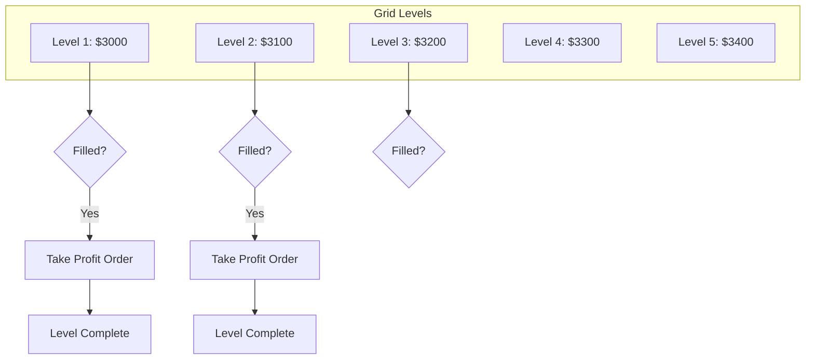

The **Grid Executor** is like a Position Executor with multiple levels. It places orders at evenly spaced price intervals between a start and end price, managing each level independently with take profit targets.

## Overview

| Property | Value |
|----------|-------|
| Position Type | Spot or Perp |
| keep_position | Configurable |
| Use Cases | Range-bound markets, accumulation, market making |

## How It Works



1. **Grid Creation**: Divides price range into evenly spaced levels
2. **Order Placement**: Places entry orders at each level
3. **Fill Management**: When a level fills, places take profit order
4. **Level Completion**: Each level manages its own entry/exit cycle
5. **Risk Management**: Overall position managed by triple barrier

## Configuration

```python
from hummingbot.strategy_v2.executors.grid_executor.data_types import GridExecutorConfig
from hummingbot.strategy_v2.executors.position_executor.data_types import TripleBarrierConfig

config = GridExecutorConfig(
    controller_id="my-agent",
    connector_name="binance",
    trading_pair="ETH-USDT",
    side=TradeType.BUY,

    # Grid boundaries
    start_price=Decimal("3000"),      # Lower bound
    end_price=Decimal("3500"),        # Upper bound
    limit_price=Decimal("2900"),      # Stop loss price

    # Sizing
    total_amount_quote=Decimal("1000"),  # Total capital to deploy
    min_spread_between_orders=Decimal("0.01"),  # 1% between levels
    min_order_amount_quote=Decimal("5"),  # Min order size

    # Execution
    max_open_orders=5,                # Max simultaneous orders
    activation_bounds=Decimal("0.02"), # Only active within 2% of price

    # Risk management
    triple_barrier_config=TripleBarrierConfig(
        stop_loss=Decimal("0.05"),    # 5% total stop loss
        time_limit=86400,              # 24 hour limit
    ),

    leverage=1,
    keep_position=False,
)
```

## Parameters

### Grid Boundaries

| Parameter | Description |
|-----------|-------------|
| `start_price` | Lower price bound of the grid |
| `end_price` | Upper price bound of the grid |
| `limit_price` | Stop loss price - exits all positions if breached |
| `side` | `BUY` for accumulation grid, `SELL` for distribution |

### Sizing

| Parameter | Default | Description |
|-----------|---------|-------------|
| `total_amount_quote` | - | Total capital to deploy across all levels |
| `min_spread_between_orders` | 0.05% | Minimum % spread between grid levels |
| `min_order_amount_quote` | 5 | Minimum order size in quote |

### Execution

| Parameter | Default | Description |
|-----------|---------|-------------|
| `max_open_orders` | 5 | Maximum simultaneous open orders |
| `max_orders_per_batch` | None | Orders to place per batch |
| `order_frequency` | 0 | Seconds between order batches |
| `activation_bounds` | None | Only keep orders within this % of current price |
| `safe_extra_spread` | 0.01% | Extra spread for safety |

### Risk Management

| Parameter | Description |
|-----------|-------------|
| `triple_barrier_config` | Stop loss, take profit, time limit for overall position |
| `leverage` | Leverage for perpetual markets |
| `keep_position` | Whether to keep net position on termination |

## Grid Level States

Each level tracks its own state independently:

| State | Description |
|-------|-------------|
| `NOT_ACTIVE` | No orders placed at this level |
| `OPEN_ORDER_PLACED` | Entry order active, waiting for fill |
| `OPEN_ORDER_FILLED` | Entry filled, take profit order being placed |
| `CLOSE_ORDER_PLACED` | Take profit order active |
| `COMPLETE` | Both entry and take profit filled |

## Example: Accumulation Grid

Buy ETH between $3000-$3500, taking profit at each level:

```python
accumulation = GridExecutorConfig(
    controller_id="eth-accumulator",
    connector_name="binance",
    trading_pair="ETH-USDT",
    side=TradeType.BUY,
    start_price=Decimal("3000"),
    end_price=Decimal("3500"),
    limit_price=Decimal("2800"),      # Stop if price crashes
    total_amount_quote=Decimal("5000"),
    min_spread_between_orders=Decimal("0.02"),  # 2% between levels
    max_open_orders=10,
    triple_barrier_config=TripleBarrierConfig(
        stop_loss=Decimal("0.10"),    # 10% overall stop
        time_limit=604800,             # 1 week
    ),
    keep_position=True,  # Keep accumulated ETH
)
```

## Example: Range Trading Grid

Trade BTC in a range, closing each level for profit:

```python
range_trade = GridExecutorConfig(
    controller_id="btc-range",
    connector_name="binance_perpetual",
    trading_pair="BTC-USDT",
    side=TradeType.BUY,
    start_price=Decimal("60000"),
    end_price=Decimal("65000"),
    limit_price=Decimal("58000"),
    total_amount_quote=Decimal("10000"),
    min_spread_between_orders=Decimal("0.01"),
    max_open_orders=5,
    activation_bounds=Decimal("0.03"),  # Orders within 3% of price
    triple_barrier_config=TripleBarrierConfig(
        stop_loss=Decimal("0.05"),
        time_limit=86400,
    ),
    leverage=3,
    keep_position=False,  # Close positions, take P&L
)
```

## Grid vs Position Executor

| Feature | Position Executor | Grid Executor |
|---------|------------------|---------------|
| Order Levels | Single | Multiple (auto-calculated) |
| Entry | One price | Range of prices |
| Take Profit | Single target | Per-level targets |
| Use Case | Directional bet | Range trading |
| Complexity | Simple | More complex |

Think of Grid Executor as running multiple Position Executors simultaneously across a price range, with coordinated risk management.

## Activation Bounds

The `activation_bounds` parameter keeps orders active only near the current price:

```python
activation_bounds=Decimal("0.02")  # 2%
```

- Orders more than 2% from current price are cancelled
- As price moves, new orders are placed within bounds
- Reduces open order count and exchange rate limits

## Position Handover

When `keep_position=True`:
- Net inventory from all levels stays in account
- Added to Position Hold for agent management
- Useful for accumulation strategies

When `keep_position=False`:
- All positions closed on termination
- Realized P&L from each level reported
- Clean exit with no leftover inventory
