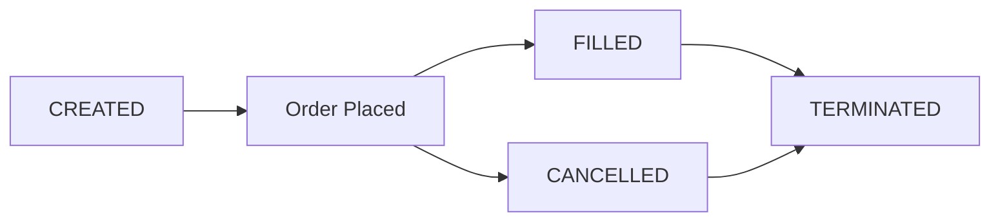

The **Order Executor** is the simplest executor type. It places a single order using one of four execution strategies and terminates when the order is filled or cancelled.

## Overview

| Property | Value |
|----------|-------|
| Position Type | Spot or Perp |
| keep_position | `true` (always) |
| Use Cases | Single entries, building positions, simple trades |

## Configuration

```python
from hummingbot.strategy_v2.executors.order_executor.data_types import (
    OrderExecutorConfig,
    ExecutionStrategy,
    LimitChaserConfig,
)

config = OrderExecutorConfig(
    controller_id="my-agent",
    connector_name="binance",
    trading_pair="BTC-USDT",
    side=TradeType.BUY,
    amount=Decimal("0.01"),
    execution_strategy=ExecutionStrategy.LIMIT,
    price=Decimal("65000.0"),
    leverage=1,
)
```

## Execution Strategies

The Order Executor supports four execution strategies:

### LIMIT

Standard limit order at a specified price. Only fills at your price or better.

```python
OrderExecutorConfig(
    connector_name="binance",
    trading_pair="ETH-USDT",
    side=TradeType.BUY,
    amount=Decimal("0.5"),
    execution_strategy=ExecutionStrategy.LIMIT,
    price=Decimal("3200.0"),  # Required for LIMIT
)
```

### LIMIT_MAKER

Post-only limit order that must be a maker order. Rejected if it would immediately fill as taker.

```python
OrderExecutorConfig(
    connector_name="binance",
    trading_pair="ETH-USDT",
    side=TradeType.BUY,
    amount=Decimal("0.5"),
    execution_strategy=ExecutionStrategy.LIMIT_MAKER,
    price=Decimal("3200.0"),  # Required for LIMIT_MAKER
)
```

Use this to ensure you pay maker fees (typically lower) and avoid crossing the spread.

### MARKET

Market order that fills immediately at the best available price.

```python
OrderExecutorConfig(
    connector_name="binance",
    trading_pair="SOL-USDT",
    side=TradeType.SELL,
    amount=Decimal("10.0"),
    execution_strategy=ExecutionStrategy.MARKET,
    # No price needed for MARKET
)
```

### LIMIT_CHASER

A limit order that chases the market price, refreshing when price moves away.

```python
OrderExecutorConfig(
    connector_name="binance",
    trading_pair="BTC-USDT",
    side=TradeType.BUY,
    amount=Decimal("0.01"),
    execution_strategy=ExecutionStrategy.LIMIT_CHASER,
    chaser_config=LimitChaserConfig(
        distance=Decimal("0.001"),       # Place order 0.1% from mid
        refresh_threshold=Decimal("0.002"),  # Refresh if price moves 0.2%
    ),
)
```

| Parameter | Description |
|-----------|-------------|
| `distance` | How far from current price to place the order |
| `refresh_threshold` | How far price must move before cancelling and replacing |

The chaser keeps adjusting your limit order to stay near the market price, giving you a better chance of filling while still using limit orders.

## Parameters

| Parameter | Type | Description |
|-----------|------|-------------|
| `connector_name` | string | Exchange connector |
| `trading_pair` | string | Market (e.g., "BTC-USDT") |
| `side` | TradeType | `BUY` or `SELL` |
| `amount` | Decimal | Order size in base asset |
| `execution_strategy` | ExecutionStrategy | One of the four strategies above |
| `price` | Decimal | Required for LIMIT and LIMIT_MAKER |
| `chaser_config` | LimitChaserConfig | Required for LIMIT_CHASER |
| `leverage` | int | Leverage for perpetual markets (default: 1) |
| `position_action` | PositionAction | `OPEN` or `CLOSE` (for perps) |

## Lifecycle



The Order Executor terminates when:
- Order is filled
- Order is cancelled
- Early stop requested

## Position Handover

Order Executor **always** uses `keep_position=true`:
- Filled orders add to the agent's Position Hold
- Tokens remain in the account
- No P&L attributed until position is closed by another executor

This makes it ideal for building positions that will be managed by Position Executor or Grid Executor.

## When to Use

| Scenario | Strategy |
|----------|----------|
| Passive entry at support | LIMIT |
| Guaranteed maker fees | LIMIT_MAKER |
| Immediate execution | MARKET |
| Better fills with patience | LIMIT_CHASER |
