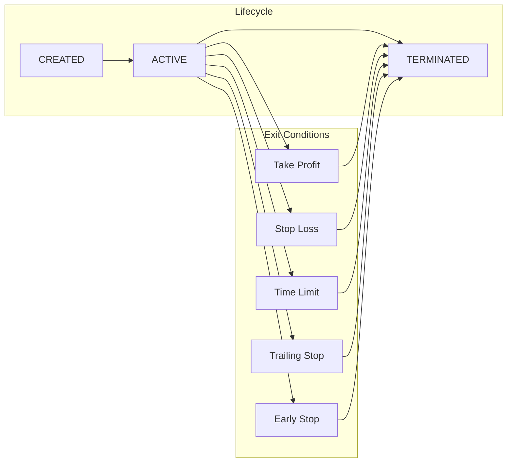

**Executors** are self-contained trading operations that manage their complete lifecycle—from entry to exit—with standardized P&L and fee reporting. Each executor is tagged with a `controller_id` linking it to the agent that created it.

## Why Executors?

Executors are the heart of the Trading Agent design. Without them, agents would place individual orders—leading to inconsistent execution, difficulty tracking P&L, and agents getting stuck in loops trying to understand why orders failed.

Agents **only ever act through executors**, which provides:

### 1. Standardization

Hummingbot has connectors to 50+ exchanges—centralized exchanges like Binance, DEXs like Hyperliquid, and blockchain networks like Solana.

If you say "trade 0.1 SOL," you can do that as a market order on Binance or as a swap on Jupiter, execute the same way, and get standardized results. The agent doesn't need to know the details of calling the Binance API versus the Jupiter API.

### 2. Error Handling

Executors have standardized error handling across all connectors. If you don't have balance, it returns "insufficient balance"—not a cryptic API error. The agent doesn't need to loop trying to understand why something failed.

### 3. Isolation

Each executor has an **owner** (`controller_id`) specified at creation. Each agent only sees executors it created—it has a virtual portfolio and virtual executors. All activity is completely isolated.

This is why the system scales: 10 agents can run in parallel without them confusing each other's actions.

### 4. Frequency Separation

If you expect the agent to place buy/sell orders at mid-frequency (minutes), but execution needs to happen at high frequency (milliseconds), executors handle this. A Grid executor operates at high frequency while the agent reasons at mid-frequency.

### 5. Position Handover

When an executor closes with `keep_position=true`, the agent retains the inventory and can manage it on the next tick.

## Executor Types

| Executor | Position Type | Primary Use |
|----------|--------------|-------------|
| [Order](/executors/order) | Spot | Limit and market orders |
| [Position](/executors/position) | Perp/Spot | Directional trades with Triple Barrier |
| [Grid](/executors/grid) | Spot/Perp | Multi-level grid trading |
| [LP](/executors/lp) | LP | Concentrated liquidity provision |

## Lifecycle



## Close Types

| Close Type | Description |
|------------|-------------|
| `TAKE_PROFIT` | Price reached take profit target |
| `STOP_LOSS` | Price reached stop loss limit |
| `TIME_LIMIT` | Maximum duration exceeded |
| `TRAILING_STOP` | Trailing stop triggered after activation |
| `EARLY_STOP` | Manually stopped by user or agent |
| `POSITION_HOLD` | Executor finished with position kept open |

## The Position-Hold Pattern

This is the key trick that makes multi-agent trading work. When an executor terminates:

### keep_position: false (default for most)

Position is fully closed:
- Spot tokens sold back to quote currency
- Perp position closed at market
- **P&L is calculated and reported**

### keep_position: true

Position is left in the Position Hold:
- Inventory stays in the account, tagged with `controller_id`
- Agent sees it on the next tick via the `positions` provider
- Agent can manage it with a new executor (scale out, hedge, flip)
- **No P&L attributed yet** because position is still open

### Example Flow

1. Agent spawns a `GridExecutor` for $500 BTC-USDT with `stop_loss_keep_position=true`
2. Grid runs, fills several buy levels, accumulates ~0.005 BTC
3. Price drops; grid hits stop-loss
4. Because of `keep_position`, executor closes but **does not sell the BTC**
5. On next tick, `positions` provider returns: *agent holds 0.005 BTC, breakeven $63,200, current $61,800*
6. Agent sees this, waits for recovery, spawns `OrderExecutor` to exit at better price
7. Position closes, round-trip realizes its (smaller) loss

Throughout this flow:
- Agent never loses track of inventory it created
- Other agents on the same account see none of this
- User can audit exactly what happened via journal and snapshots

## Standardized Metrics

All executors report metrics in a standardized format:

| Metric | Description |
|--------|-------------|
| `net_pnl_quote` | Realized P&L in quote currency |
| `fees_paid_quote` | Trading fees, gas costs |
| `value_quote` | Current position value |
| `volume_quote` | Total trading volume |
| `close_type` | How executor terminated |
| `duration_seconds` | Time from creation to termination |

## Creating Executors

Agents create executors via MCP tools:

```python
result = await mcp_tools.manage_executors(
    action="create",
    executor_type="position_executor",
    config={
        "controller_id": agent_id,  # Automatically set to agent's ID
        "connector_name": "binance_perpetual",
        "trading_pair": "SOL-USDT",
        "side": "BUY",
        "amount": 10.0,
        "triple_barrier_config": {
            "take_profit": 0.02,
            "stop_loss": 0.01,
        }
    }
)
```

The Risk Engine validates each request before creation:
- `executor_count < max_open_executors`
- `order_amount < max_single_order_quote`
- `total_exposure + new_amount < max_position_size_quote`

If validation fails, the agent receives an error message explaining which limit would be violated.

## Via API

List active executors:

```bash
curl -u admin:admin http://localhost:8000/executors
```

Filter by controller:

```bash
curl -u admin:admin "http://localhost:8000/executors?controller_id=my-agent"
```

Stop an executor:

```bash
curl -u admin:admin -X DELETE http://localhost:8000/executors/{executor_id}
```
