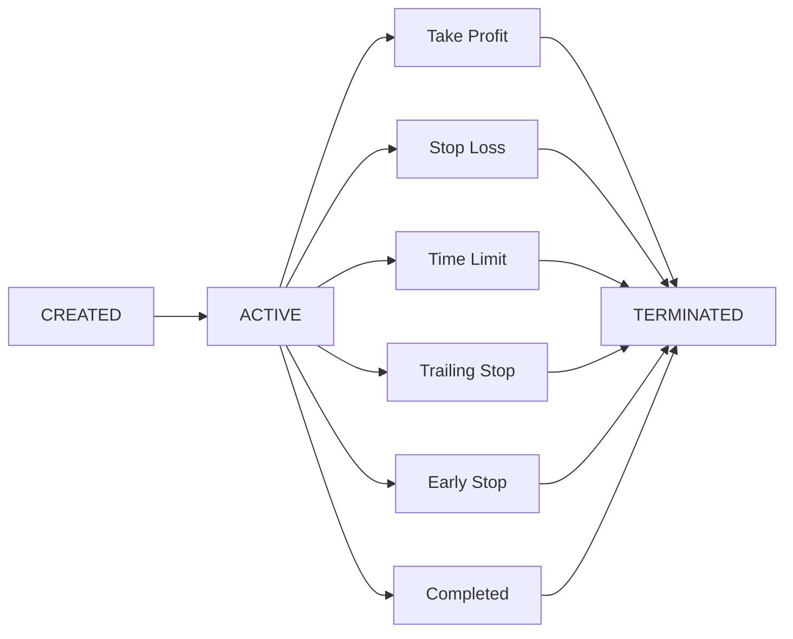

**Executors** are self-contained trading operations that manage their complete lifecycle—from entry to exit—with standardized P&L and fee reporting. Each executor is tagged with a `controller_id` linking it to the agent that created it.

## Why Executors?

Executors are the heart of the Trading Agent design. Agents **only act through executors**, which provides:

| Benefit | Description |
|---------|-------------|
| **Standardization** | Same interface across 50+ exchanges |
| **Error Handling** | Clear errors instead of cryptic API responses |
| **Isolation** | Each agent only sees its own executors via `controller_id` |
| **Frequency Separation** | Agent reasons at mid-frequency; executor operates at high frequency |
| **Position Handover** | `keep_position=true` retains inventory for the next tick |

## Executor Types

From simplest to most complex:

| Executor | Description | Builds On |
|----------|-------------|-----------|
| [Order Executor](/executors/order-executor) | Places and executes a single order | - |
| [Position Executor](/executors/position-executor) | Order + TP/SL/trailing stop/time limit management | Order |
| [Grid Executor](/executors/grid-executor) | Multiple Position Executors across a price range | Position |
| [DCA Executor](/executors/dca-executor) | Multiple orders at different price levels | Order |
| [TWAP Executor](/executors/twap-executor) | Orders spread over time | Order |
| [XEMM Executor](/executors/xemm-executor) | Cross-exchange market making | Order |
| [Arbitrage Executor](/executors/arbitrage-executor) | Cross-market arbitrage | Order |
| [LP Executor](/executors/lp-executor) | Concentrated liquidity provision | - |

### The Core Three

**Order Executor** is the simplest—it places an order using one of four execution strategies (LIMIT, LIMIT_MAKER, MARKET, LIMIT_CHASER) and terminates when filled.

**Position Executor** builds on Order Executor by adding position management: after the entry order fills, it monitors the position and exits at take profit, stop loss, trailing stop, or time limit.

**Grid Executor** is like running multiple Position Executors simultaneously across a price range, with each level having its own entry and take profit orders.

## Lifecycle

All executors follow a standard lifecycle:



| Close Type | Description |
|------------|-------------|
| `TAKE_PROFIT` | Price reached profit target |
| `STOP_LOSS` | Price reached loss limit |
| `TIME_LIMIT` | Maximum duration exceeded |
| `TRAILING_STOP` | Trailing stop triggered |
| `EARLY_STOP` | Manually stopped |
| `COMPLETED` | Finished normally (order filled) |
| `FAILED` | Failed after retries |

## Position Handover

When an executor terminates with `keep_position=true`:

1. Inventory stays in the account, tagged with `controller_id`
2. Agent sees it on the next tick via the positions provider
3. Agent can manage it with a new executor (scale out, hedge, exit)
4. P&L is not attributed until position is fully closed

**Example**: Grid hits stop-loss → keeps 0.005 BTC → agent waits for recovery → spawns Order Executor to exit at better price.

## Creating Executors

### Via MCP Tools

```python
result = await mcp_tools.manage_executors(
    action="create",
    executor_type="position_executor",
    config={
        "connector_name": "binance_perpetual",
        "trading_pair": "SOL-USDT",
        "side": "BUY",
        "amount": 10.0,
        "triple_barrier_config": {
            "take_profit": 0.02,
            "stop_loss": 0.01,
        }
    }
)
```

### Via API

```bash
# List executors
curl -u admin:admin http://localhost:8000/executors

# Filter by agent
curl -u admin:admin "http://localhost:8000/executors?controller_id=my-agent"

# Stop executor
curl -u admin:admin -X DELETE http://localhost:8000/executors/{id}
```

## Standardized Metrics

All executors report:

| Metric | Description |
|--------|-------------|
| `net_pnl_quote` | Realized P&L in quote currency |
| `fees_paid_quote` | Trading fees, gas costs |
| `volume_quote` | Total trading volume |
| `close_type` | How executor terminated |
| `duration_seconds` | Time from creation to termination |
