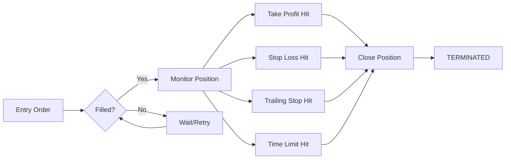

The **Position Executor** places an entry order and, once filled, manages the position using the Triple Barrier Method—automatically closing at take profit, stop loss, trailing stop activation, or time limit.

## Overview

| Property | Value |
|----------|-------|
| Position Type | Spot or Perp |
| keep_position | Configurable |
| Use Cases | Directional trades, scalping, swing trading |

## How It Works



1. **Entry**: Places order at `entry_price` (or market if not specified)
2. **Monitor**: Once filled, continuously monitors price against barriers
3. **Exit**: First barrier hit triggers position close
4. **Report**: Reports P&L and terminates

## Configuration

```python
from hummingbot.strategy_v2.executors.position_executor.data_types import (
    PositionExecutorConfig,
    TripleBarrierConfig,
    TrailingStop,
)

config = PositionExecutorConfig(
    controller_id="my-agent",
    connector_name="binance_perpetual",
    trading_pair="SOL-USDT",
    side=TradeType.BUY,
    amount=Decimal("10.0"),
    entry_price=Decimal("150.0"),  # Optional: None for market entry
    leverage=5,
    triple_barrier_config=TripleBarrierConfig(
        take_profit=Decimal("0.02"),      # 2% profit target
        stop_loss=Decimal("0.01"),         # 1% stop loss
        time_limit=3600,                   # 1 hour max
        trailing_stop=TrailingStop(
            activation_price=Decimal("0.01"),  # Activate at 1% profit
            trailing_delta=Decimal("0.005"),   # Trail by 0.5%
        ),
    ),
)
```

## Triple Barrier Config

The `TripleBarrierConfig` defines all exit conditions:

| Parameter | Type | Description |
|-----------|------|-------------|
| `take_profit` | Decimal | Exit when profit reaches this % (e.g., 0.02 = 2%) |
| `stop_loss` | Decimal | Exit when loss reaches this % (e.g., 0.01 = 1%) |
| `time_limit` | int | Exit after this many seconds |
| `trailing_stop` | TrailingStop | Dynamic stop that follows price |
| `open_order_type` | OrderType | Entry order type (default: LIMIT) |
| `take_profit_order_type` | OrderType | TP exit order type (default: MARKET) |
| `stop_loss_order_type` | OrderType | SL exit order type (default: MARKET) |
| `time_limit_order_type` | OrderType | Time exit order type (default: MARKET) |

### Take Profit

Closes position when price moves in your favor by the specified percentage.

```python
TripleBarrierConfig(
    take_profit=Decimal("0.02"),  # Close at 2% profit
)
```

For a long position entered at $100, take profit triggers at $102.

### Stop Loss

Closes position when price moves against you by the specified percentage.

```python
TripleBarrierConfig(
    stop_loss=Decimal("0.01"),  # Close at 1% loss
)
```

For a long position entered at $100, stop loss triggers at $99.

### Time Limit

Closes position after a maximum duration, regardless of P&L.

```python
TripleBarrierConfig(
    time_limit=3600,  # Close after 1 hour
)
```

### Trailing Stop

A dynamic stop loss that follows the price as it moves in your favor.

```python
TripleBarrierConfig(
    trailing_stop=TrailingStop(
        activation_price=Decimal("0.01"),  # Start trailing at 1% profit
        trailing_delta=Decimal("0.005"),   # Keep stop 0.5% behind
    ),
)
```

**How it works**:
1. Position enters at $100
2. Price rises to $101 (1% profit) → trailing stop activates
3. Stop is placed at $100.50 (0.5% below current price)
4. Price rises to $103 → stop moves to $102.49
5. Price drops to $102.49 → trailing stop triggers, position closes

The trailing stop locks in gains while letting winners run.

## Parameters

| Parameter | Type | Description |
|-----------|------|-------------|
| `connector_name` | string | Exchange connector |
| `trading_pair` | string | Market (e.g., "SOL-USDT") |
| `side` | TradeType | `BUY` (long) or `SELL` (short) |
| `amount` | Decimal | Position size in base asset |
| `entry_price` | Decimal | Entry price (None for market order) |
| `leverage` | int | Leverage for perpetual markets |
| `triple_barrier_config` | TripleBarrierConfig | Exit conditions |
| `activation_bounds` | List[Decimal] | Optional price bounds to activate |

## Order Types

You can configure which order type to use for each action:

```python
TripleBarrierConfig(
    open_order_type=OrderType.LIMIT,       # Entry: limit order
    take_profit_order_type=OrderType.LIMIT, # TP: limit order
    stop_loss_order_type=OrderType.MARKET,  # SL: market order (fast exit)
    time_limit_order_type=OrderType.MARKET, # Time: market order
)
```

Use LIMIT for entries and take profits to get better fills. Use MARKET for stop losses to ensure execution.

## Example: Scalp Trade

```python
scalp = PositionExecutorConfig(
    controller_id="scalper",
    connector_name="binance_perpetual",
    trading_pair="BTC-USDT",
    side=TradeType.BUY,
    amount=Decimal("0.01"),
    leverage=10,
    triple_barrier_config=TripleBarrierConfig(
        take_profit=Decimal("0.003"),  # 0.3% profit
        stop_loss=Decimal("0.002"),    # 0.2% stop
        time_limit=300,                # 5 min max
    ),
)
```

## Example: Swing Trade with Trailing Stop

```python
swing = PositionExecutorConfig(
    controller_id="swing-trader",
    connector_name="binance",
    trading_pair="ETH-USDT",
    side=TradeType.BUY,
    amount=Decimal("0.5"),
    entry_price=Decimal("3200.0"),
    triple_barrier_config=TripleBarrierConfig(
        take_profit=Decimal("0.10"),   # 10% target
        stop_loss=Decimal("0.03"),     # 3% stop
        time_limit=86400,              # 24 hours
        trailing_stop=TrailingStop(
            activation_price=Decimal("0.05"),  # Trail after 5% profit
            trailing_delta=Decimal("0.02"),    # 2% trail distance
        ),
    ),
)
```

## Close Types

When the executor terminates, it reports which barrier was hit:

| Close Type | Description |
|------------|-------------|
| `TAKE_PROFIT` | Price reached profit target |
| `STOP_LOSS` | Price reached loss limit |
| `TIME_LIMIT` | Maximum duration exceeded |
| `TRAILING_STOP` | Trailing stop triggered |
| `EARLY_STOP` | Manually stopped |

## Position Handover

If `keep_position=true` (set via early stop):
- Position remains open in the account
- Added to agent's Position Hold for later management

If `keep_position=false` (default for barrier exits):
- Position fully closed
- Realized P&L calculated and reported
