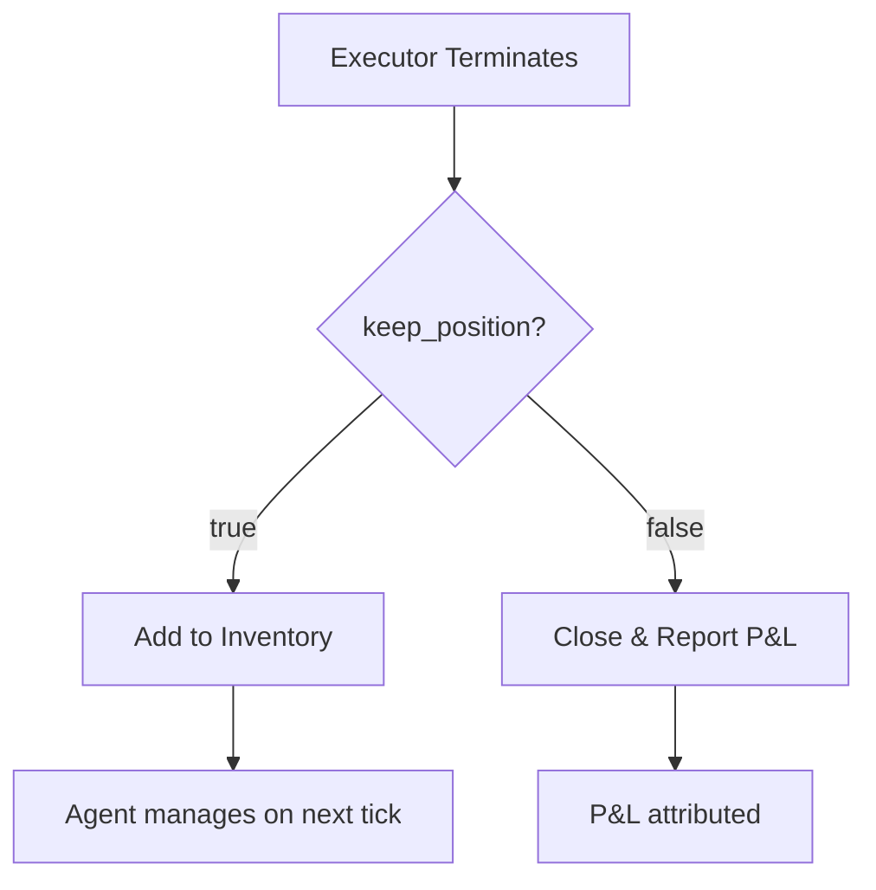

**Position Handover** is the mechanism by which executors transfer their positions to the agent's inventory (Position Hold) when they terminate with `keep_position=true`.

## How It Works

When an executor terminates, it can either:
- **Close the position** and report realized P&L
- **Hand over the position** to the agent's inventory for later management



## keep_position Behavior

| Setting | Behavior |
|---------|----------|
| `true` | Position added to inventory, no P&L attributed yet |
| `false` | Position closed, realized P&L calculated and reported |

## Executor Defaults

| Executor | keep_position | Rationale |
|----------|---------------|-----------|
| Order Executor | `true` (always) | Builds positions for other executors |
| Position Executor | Configurable | Usually closes on barrier hit |
| Grid Executor | Configurable | Can accumulate or close per-level |
| DCA Executor | Configurable | Often accumulates across levels |
| LP Executor | Configurable | Always closes on-chain, optionally tracks tokens |

## The Handover Flow

### 1. Executor Creates Trades

```python
# Position Executor entry
entry_order = {
    "connector_name": "binance",
    "trading_pair": "SOL-USDT",
    "side": "BUY",
    "amount": 10.0,
    "price": 150.0,
}
```

### 2. Executor Terminates

When the executor terminates (e.g., stop loss hit with `keep_position=true`):

```python
# Executor reports
close_type = "STOP_LOSS"
held_position = {
    "connector_name": "binance",
    "trading_pair": "SOL-USDT",
    "side": "BUY",
    "amount": 10.0,
    "entry_price": 150.0,
}
```

### 3. Position Added to Inventory

The Position Hold aggregates with any existing position:

```python
# Agent's inventory for (binance, SOL-USDT)
{
    "buy_amount_base": 10.0,
    "buy_amount_quote": 1500.0,
    "breakeven_price": 150.0,
    "unrealized_pnl_quote": -50.0,  # At current price $145
}
```

### 4. Agent Manages on Next Tick

On the next tick, the agent sees the position:

```
Current Positions:
- binance SOL-USDT: Long 10 SOL @ $150 (unrealized: -$50)
```

The agent can then:
- Wait for recovery
- Spawn a new executor to exit
- Hedge with another position
- Add to the position

## Example: Grid Stop-Loss Recovery

```python
# Grid Executor hits stop loss
grid_config = GridExecutorConfig(
    keep_position=True,  # Keep accumulated inventory
    triple_barrier_config=TripleBarrierConfig(
        stop_loss=Decimal("0.05"),
    ),
)

# After stop loss:
# - Grid executor terminates
# - Net inventory (e.g., 0.5 BTC) stays in account
# - Position added to agent's inventory

# On next tick, agent sees:
# "Held position: Long 0.5 BTC @ $62,500"

# Agent decides to wait for recovery
# Later, spawns Order Executor to exit at better price:
exit_config = OrderExecutorConfig(
    side=TradeType.SELL,
    amount=Decimal("0.5"),
    execution_strategy=ExecutionStrategy.LIMIT,
    price=Decimal("64000"),  # Better exit
)
```

## LP Position Handover

LP positions work differently:

1. **On-chain position always closes** when executor terminates
2. If `keep_position=true`, the **net token change** is tracked
3. ADD events → SELL (tokens left wallet)
4. REMOVE events → BUY (tokens + fees returned)

```python
# LP Executor closes
lp_result = {
    "initial_base": 10.0,
    "initial_quote": 1500.0,
    "final_base": 9.5,      # Less base (sold some)
    "final_quote": 1600.0,  # More quote (fees earned)
    "fees_earned_base": 0.1,
    "fees_earned_quote": 15.0,
}

# If keep_position=True:
# Net change tracked in inventory as spot position
```

## Position Accumulation

Multiple executors can add to the same position:

```
Trade 1 (Order Executor): Buy 10 SOL @ $150
Trade 2 (Order Executor): Buy 5 SOL @ $145
Trade 3 (Grid level):     Buy 5 SOL @ $140

Inventory: Long 20 SOL @ $146.25 (weighted average)
```

Each executor adds to the Position Hold, creating a single aggregated position.

## When to Use keep_position

| Scenario | Setting | Why |
|----------|---------|-----|
| Building a position over time | `true` | Accumulate across multiple executors |
| Quick scalp trade | `false` | Clean exit, immediate P&L |
| Grid accumulation | `true` | Keep inventory for later exit |
| Range trading grid | `false` | Lock in profits per level |
| Recovery from stop loss | `true` | Allow agent to manage exit |

## Related

- [Inventory](/trading-agents/inventory) - The virtual portfolio concept
- [Executors Overview](/executors/overview) - All executor types
