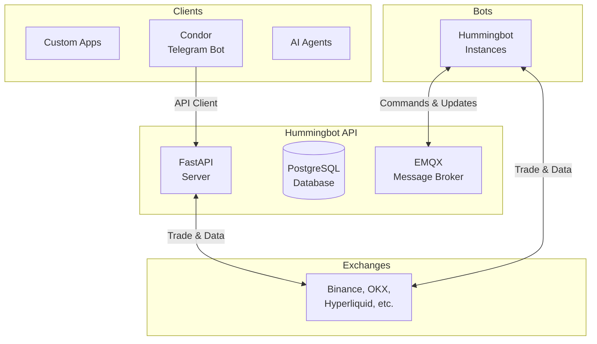

A comprehensive RESTful API framework for managing trading operations across multiple exchanges. The Hummingbot API provides a centralized platform to aggregate all your trading functionalities, from basic account management to sophisticated automated trading strategies.

<Card title="GitHub Repository" icon="github" href="https://github.com/hummingbot/hummingbot-api">
  github.com/hummingbot/hummingbot-api
</Card>

## What is Hummingbot API?

The Hummingbot API is designed to be your central hub for trading operations, offering:

<CardGroup cols={2}>
  <Card title="AI Assistant Integration" icon="robot">
    Control your trading with natural language via MCP (Claude, ChatGPT, Gemini)
  </Card>
  <Card title="Multi-Exchange Management" icon="building-columns">
    Create and manage multiple trading accounts across different exchanges
  </Card>
  <Card title="Portfolio Monitoring" icon="chart-line">
    Real-time balance tracking and portfolio distribution analysis
  </Card>
  <Card title="Trade Execution" icon="bolt">
    Execute trades, manage orders, and monitor positions across all accounts
  </Card>
  <Card title="Automated Trading" icon="gears">
    Deploy and control Hummingbot instances with automated strategies
  </Card>
  <Card title="Strategy Management" icon="chess">
    Add, configure, and manage trading strategies in real-time
  </Card>
</CardGroup>

## Architecture



### Key Components

| Component | Description |
|-----------|-------------|
| **FastAPI Server** | RESTful API with HTTP Basic Authentication (port 8000) |
| **PostgreSQL** | Database for trading data, account info, and historical performance |
| **EMQX** | Message broker for real-time communication with bot instances |
| **Exchange Connectors** | Built-in connectors for major CEXs and DEXs |
| **Bot Instances** | Individual Hummingbot containers connected to different exchanges |

## Ways to Interact

<Tabs>
  <Tab title="Condor (Recommended)">
    **Mobile and desktop control via Telegram**

    - Best for users who want to monitor and control bots on the go
    - Access from any device with Telegram
    - Real-time notifications and alerts
    - Quick commands for common operations

    [Condor Documentation →](/condor/index)
  </Tab>
  <Tab title="Swagger UI">
    **Interactive REST API documentation and testing**

    - Best for developers and power users who want full control
    - Complete API access - all endpoints available
    - Direct endpoint testing
    - Available at `http://localhost:8000/docs`
  </Tab>
  <Tab title="MCP (AI Assistant)">
    **Natural language trading commands through Claude, ChatGPT, or Gemini**

    - Best for users who prefer conversational interaction
    - Natural language commands
    - Contextual help and explanations
    - Complex multi-step operations made simple
  </Tab>
</Tabs>

## Use Cases

The Hummingbot API enables various trading applications:

- **Custom OEMS**: Build your own order execution management system spanning multiple exchanges
- **Trading Dashboards**: Build custom chat, web, and mobile interfaces for controlling bots
- **AI-Powered Trading**: Integrate with LLMs for agentic trading workflows
- **Risk Management Tools**: Build systems for monitoring and managing trading operations
- **Market Data Feeds**: Create real-time price and historical candles feeds

## API Endpoints Overview

The API is organized into functional routers:

| Router | Description |
|--------|-------------|
| **Docker** | Container lifecycle and orchestration |
| **Accounts** | Multi-exchange account configuration |
| **Connectors** | Exchange connector information |
| **Portfolio** | Real-time portfolio tracking and analytics |
| **Trading** | Order execution and position management |
| **Bot Orchestration** | Deploy and manage trading bots |
| **Controllers/Scripts** | Strategy management |
| **Market Data** | Real-time and historical market data |
| **Backtesting** | Strategy testing with historical data |
| **Gateway** | DEX infrastructure management |
| **Gateway Swaps** | DEX swap execution |
| **Gateway CLMM** | Concentrated liquidity position management |

<Card title="Full API Reference" icon="code" href="/api-reference/introduction">
  View complete API documentation with all endpoints
</Card>

## Python Client

A modern, asynchronous Python client is available for interacting with the Hummingbot API.

<CardGroup cols={2}>
  <Card title="GitHub" icon="github" href="https://github.com/hummingbot/hummingbot-api-client">
    hummingbot-api-client
  </Card>
  <Card title="PyPI" icon="python" href="https://pypi.org/project/hummingbot-api-client/">
    pip install hummingbot-api-client
  </Card>
</CardGroup>

```python
from hummingbot_api_client import HummingbotAPIClient

# Initialize client
client = HummingbotAPIClient(
    base_url="http://localhost:8000",
    username="your-username",
    password="your-password"
)

# Get portfolio data
portfolio = await client.get_portfolio()

# Execute a trade
order = await client.create_order(
    connector="binance",
    trading_pair="BTC-USDT",
    order_type="limit",
    side="buy",
    amount=0.001,
    price=50000
)
```

## Next Steps

<CardGroup cols={2}>
  <Card title="Installation" icon="download" href="/hummingbot-api/installation">
    Install Hummingbot API with Docker or from source
  </Card>
  <Card title="Developer Guide" icon="code" href="/hummingbot-api/quickstart">
    Learn to use the API with curl and Python examples
  </Card>
</CardGroup>
