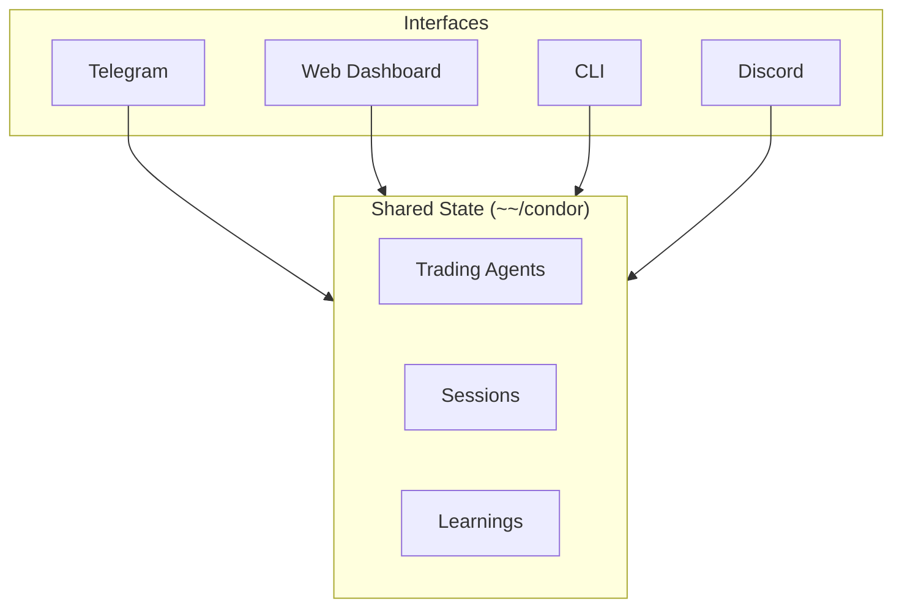

Condor's architecture supports multiple interfaces through the Trading Agents Standard and ACP (Agent Client Protocol).

## Planned Integrations

| Interface | Status | Description |
|-----------|--------|-------------|
| **Discord Bot** | Planned | Team collaboration, alerts, and bot management |
| **Slack Integration** | Planned | Enterprise notifications and commands |
| **CLI Tool** | Planned | Command-line interface for power users |
| **Mobile App** | Future | Native iOS/Android applications |

## Session Continuity

All interfaces share the same session state via the `~/condor` directory:

You can:
- Start a Trading Agent on Telegram
- Monitor it in the web dashboard
- Debug via CLI
- Get alerts in Discord

Same session, same agent state, same conversation history.

## Building Custom Interfaces

Condor's API-first design makes it straightforward to build custom interfaces:

1. **Connect to Hummingbot API** for execution and market data
2. **Use ACP** for LLM integration
3. **Read/write** the `~/condor` directory for agent state

## Contributing

Interested in building an interface for Condor?

- Join [#condor-feedback](https://discord.gg/hummingbot) in Discord
- Review the [Condor source code](https://github.com/hummingbot/condor)
- Check the [Hummingbot API](https://github.com/hummingbot/hummingbot-api) for available endpoints
