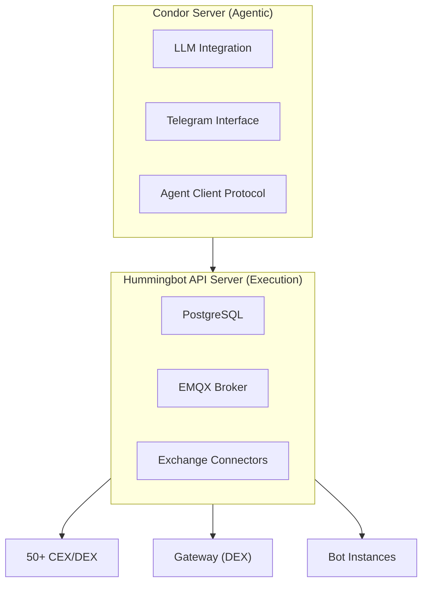
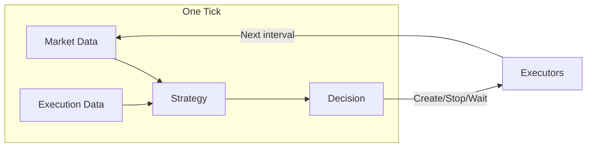
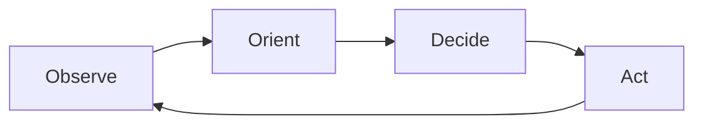

## The Problem

There's a lot of potential in applying AI agents to trading. But how do you make it all work together?

It's easy to create a simple demo, but as most algo traders and market makers know, if you really want to make money over the long term, you have to build a systematic approach. You need to:

- Calculate P&L accurately across different exchanges
- Have the agent actually learn from what it's doing systematically
- Run many agents that operate independently but also work together

Professional market makers and rewards farmers typically run multiple trading strategies simultaneously. Managing multiple AI agents across a shared portfolio—without spinning up separate sub-accounts for each—is a core operational challenge.

## The Harness Concept

Condor is an **agent harness**—a system that helps you accomplish tasks using LLMs. Similar in concept to OpenClaw, but purpose-built for trading rather than general productivity.

| Harness | Focus | Architecture |
|---------|-------|--------------|
| **OpenClaw** | General productivity (email, tasks) | Single gateway server handling LLMs and messaging |
| **Condor** | Trading (data collection, execution) | Two servers separating agentic from execution layer |

If you're doing trading tasks, you may not want the open, possibly insecure mode of doing things the way OpenClaw does. You want trade execution separated from the agent layer—which is how Condor is structured.

## Two-Server Architecture

Condor uses a **two-server architecture** that separates the agentic layer from the execution layer:

| Server | Role |
|--------|------|
| **Condor Server** | Interfaces with LLMs, handles user interaction via Telegram |
| **Hummingbot API Server** | Deterministic execution across 50+ exchanges and blockchains |

### Why Separated?

**Speed**: Deterministic algorithms execute without waiting on LLM inference. When a take-profit or stop-loss triggers, execution happens immediately. The expensive activity in trading is at the network layer—sending trades to exchanges and waiting for responses, or talking to LLMs. Separating these concerns lets each layer optimize independently.

**Token Efficiency**: Instead of passing raw market data to the LLM, deterministic code handles routine operations. We found that agents waste enormous amounts of tokens processing data and computing indicators. By moving this into deterministic **routines**, we reduced session time from two minutes to under one minute while improving reliability.

**Isolation & Security**: You're not giving full machine access to the LLM. Instead, the Hummingbot API dictates what types of trades can be performed and tracks the P&L of all activity. In a live trading environment, this constraint is critical.

**Standardization**: Hummingbot has connectors to 50+ exchanges—centralized exchanges like Binance, DEXs like Hyperliquid, and blockchain networks like Solana. If you say "trade 0.1 SOL," you can do that as a market order on Binance or as a swap on Jupiter, execute the same way, and get standardized results. The agent doesn't need to worry about the details of different APIs.

## The Tick

Similar to how LLMs have the concept of a "turn" (you give something to the model and get something back), trading has the concept of a **tick**. A tick is one iteration of the agent's decision loop, happening at a defined time interval.

Each tick, the agent:
1. Gathers **market data** (candles, order book, funding rates)
2. Gathers **execution data** (active executors, positions, P&L)
3. Runs the **strategy** to decide: create something, stop something, or wait

This loops continuously at the configured frequency (e.g., every 60 seconds).

## The OODA Loop

The tick follows the **OODA loop**, a decision-making framework developed by military strategist John Boyd:

| Phase | Layer | Description |
|-------|-------|-------------|
| **Observe** | Deterministic | Fetch portfolio state, positions, market data via Hummingbot API |
| **Orient** | Probabilistic | Load journal (learnings, state, recent actions) and build context |
| **Decide** | Probabilistic | LLM reasons about strategy and determines actions |
| **Act** | Deterministic | Execute via API, record results to journal |

The loop is **probabilistic** in Orient and Decide (LLM-powered) and **deterministic** in Observe and Act (Hummingbot API).

## Multi-Agent Framework

Think about running a hundred agents—how do they all operate independently while working together? This is the core question we address with the **Trading Standard**.

### The Problem It Solves

Professional market makers and rewards farmers run multiple strategies simultaneously. Managing multiple agents across a shared portfolio—without spinning up separate sub-accounts for each—is a core operational challenge.

### How It Works

- A **portfolio** is a set of accounts across different exchanges and blockchains
- Multiple **agents** can operate on the same portfolio simultaneously
- Each agent:
  - Acts on its own **allocated slice** of the portfolio
  - Tracks the **changes it makes** independently via `controller_id`
  - Has its own **P&L tracking**, separate from others
- Agents operate independently—**no sub-accounts needed**

### Why Executors Enable This

Each executor has an **owner** specified when created. The agent only sees executors it created—it has a virtual portfolio and virtual executors. All activity is completely isolated.

This is why the system scales: you can have 10 agents running in parallel without them having trouble understanding what actions each agent took.

### Why It Matters

Scaling to dozens or hundreds of agents is what enables agents to **learn and self-improve** over time—the foundation for a truly autonomous trading system.
