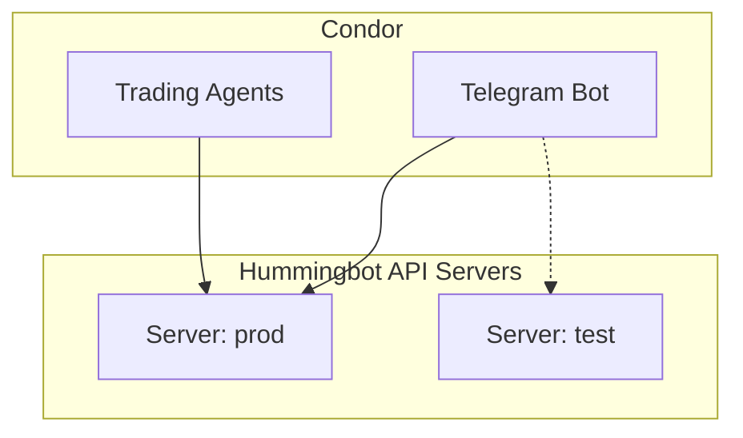

The `/config` command manages connections to Hummingbot API servers.

## Server Configuration

Condor can connect to multiple Hummingbot API servers. Use `/config → API Servers` to manage connections.

### Add Server

```
/config → API Servers → Add Server
```

Enter:
- **Name**: Friendly name (e.g., `prod`, `test`)
- **Host**: Server hostname or IP
- **Port**: API port (default: 8000)
- **Username**: API username
- **Password**: API password

### Switch Server

```
/config → API Servers → Select server → Set Active
```

The active server is used for all trading operations.

## Via API

### Health Check

```bash
curl -u admin:admin http://localhost:8000/health
```

Response:
```json
{
  "status": "ok",
  "version": "1.0.0"
}
```

### Server Status

```bash
curl -u admin:admin http://localhost:8000/bot-orchestration/status
```

## Via MCP Tools

Agents can manage server connections:

```python
# List servers
servers = await mcp_tools.manage_servers(action="list")

# Check current server
context = await mcp_tools.get_user_context()
print(context["active_server"])

# Switch server (runtime)
await mcp_tools.configure_server(
    url="http://prod-server:8000",
    username="admin",
    password="secret"
)
```

## Server Architecture



## Multiple Servers

Use multiple servers to:
- Separate production from testing
- Connect to different regions
- Isolate different portfolios

Each server has its own:
- Exchange credentials
- Trading history
- Bot instances
- Executor state
