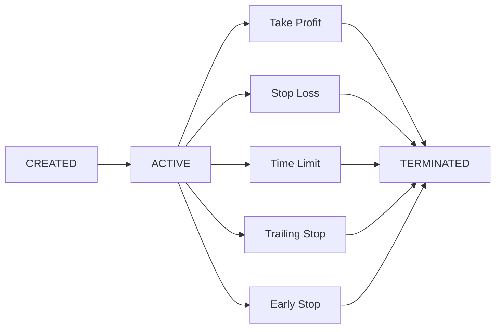

**Executors** are self-contained trading operations that manage their complete lifecycle—from entry to exit—with standardized P&L and fee reporting. Each executor is tagged with a `controller_id` linking it to the agent that created it.

## Why Executors?

Executors are the heart of the Trading Agent design. Agents **only ever act through executors**, which provides:

| Benefit | Description |
|---------|-------------|
| **Standardization** | Same interface across 50+ exchanges—Binance, Hyperliquid, Jupiter, etc. |
| **Error Handling** | Standardized errors ("insufficient balance") instead of cryptic API responses |
| **Isolation** | Each agent only sees its own executors via `controller_id` |
| **Frequency Separation** | Agent reasons at mid-frequency; executor operates at high frequency |
| **Position Handover** | `keep_position=true` retains inventory for the next tick |

## Executor Types

### Order Executor

Places limit and market orders on CEX or DEX.

| Property | Value |
|----------|-------|
| Position Type | Spot |
| keep_position | `true` (default) |
| Use Cases | Limit entries, DCA, building positions |

```python
OrderExecutorConfig(
    connector_name="binance",
    trading_pair="BTC-USDT",
    side=TradeType.BUY,
    amount=Decimal("0.01"),
    execution_strategy=ExecutionStrategy(
        order_type=OrderType.LIMIT,
        price=Decimal("65000.0"),
    ),
)
```

### Position Executor

Manages perp/spot positions with Triple Barrier exit conditions.

| Property | Value |
|----------|-------|
| Position Type | Perp or Spot |
| Exit Conditions | Take profit, stop loss, time limit, trailing stop |
| Use Cases | Directional trades, scalping, hedging |

```python
PositionExecutorConfig(
    connector_name="binance_perpetual",
    trading_pair="SOL-USDT",
    side=TradeType.BUY,
    amount=Decimal("10.0"),
    leverage=5,
    triple_barrier_config=TripleBarrierConfig(
        take_profit=Decimal("0.02"),   # 2%
        stop_loss=Decimal("0.01"),     # 1%
        time_limit=3600,               # 1 hour
        trailing_stop=TrailingStop(
            activation_price=Decimal("0.01"),
            trailing_delta=Decimal("0.005"),
        ),
    ),
)
```

### Grid Executor

Multi-level grid trading with inventory tracking.

| Property | Value |
|----------|-------|
| Position Type | Spot or Perp |
| keep_position | Configurable |
| Use Cases | Range-bound markets, accumulation, mean reversion |

```python
GridExecutorConfig(
    connector_name="binance",
    trading_pair="ETH-USDT",
    side=TradeType.BUY,
    start_price=Decimal("3000"),
    end_price=Decimal("4000"),
    limit_price=Decimal("2900"),
    total_amount_quote=Decimal("1000"),
    keep_position=True,
)
```

### LP Executor

Liquidity provision on CLMM DEXs (Orca, Raydium, Meteora, Uniswap V3).

| Property | Value |
|----------|-------|
| Position Type | LP |
| P&L Calculation | Fees earned - impermanent loss - tx fees |
| Use Cases | Earning LP fees, concentrated liquidity strategies |

```python
LPExecutorConfig(
    connector_name="meteora",
    pool_address="5Q544fK...",
    lower_price=Decimal("140.0"),
    upper_price=Decimal("160.0"),
    base_amount=Decimal("1.0"),
    quote_amount=Decimal("150.0"),
    auto_close_above_range_seconds=3600,
)
```

## Lifecycle



## Position-Hold Pattern

When an executor terminates with `keep_position=true`:

1. Inventory stays in the account, tagged with `controller_id`
2. Agent sees it on the next tick via the `positions` provider
3. Agent can manage it with a new executor (scale out, hedge, exit)
4. P&L is not attributed until position is fully closed

**Example**: Grid hits stop-loss → keeps 0.005 BTC → agent waits for recovery → spawns OrderExecutor to exit at better price.

## Creating Executors

Via MCP tools:

```python
result = await mcp_tools.manage_executors(
    action="create",
    executor_type="position_executor",
    config={
        "connector_name": "binance_perpetual",
        "trading_pair": "SOL-USDT",
        "side": "BUY",
        "amount": 10.0,
        "triple_barrier_config": {
            "take_profit": 0.02,
            "stop_loss": 0.01,
        }
    }
)
```

Via API:

```bash
# List executors
curl -u admin:admin http://localhost:8000/executors

# Filter by agent
curl -u admin:admin "http://localhost:8000/executors?controller_id=my-agent"

# Stop executor
curl -u admin:admin -X DELETE http://localhost:8000/executors/{id}
```

## Standardized Metrics

All executors report:

| Metric | Description |
|--------|-------------|
| `net_pnl_quote` | Realized P&L in quote currency |
| `fees_paid_quote` | Trading fees, gas costs |
| `volume_quote` | Total trading volume |
| `close_type` | How executor terminated |
| `duration_seconds` | Time from creation to termination |
