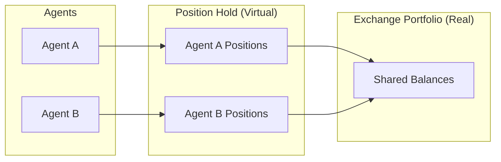

**Inventory** (also called Position Hold) is the virtual portfolio that tracks a Trading Agent's cumulative trading impact. It enables accurate P&L attribution when multiple agents share the same exchange accounts.

## Why Inventory Tracking?

When multiple agents trade on shared accounts, you need to know:
- Which agent made which trades
- Each agent's individual P&L
- Total exposure per agent

The Inventory system solves this by tracking positions per `controller_id` (agent ID).

## Position Hold

Each position is uniquely keyed by `(connector_name, trading_pair)`:



Two agents can trade the same pair on the same exchange, and each maintains their own separate position with their own breakeven price and P&L.

## Position Types

| Type | Connectors | Description |
|------|------------|-------------|
| **Spot** | `binance`, `coinbase`, `jupiter` | Standard buy/sell positions |
| **Perp** | `binance_perpetual`, `hyperliquid_perpetual` | Leveraged long/short positions |
| **LP** | `meteora`, `uniswap_v3` | Liquidity provider positions |

## Trading Pair Format

```
trading_pair = "SOL-USDT"
                 │    │
                 │    └── Quote Asset (USDT)
                 │        - P&L measured in this currency
                 │
                 └── Base Asset (SOL)
                     - The asset being traded
                     - Amount always in this unit
```

**Key principle**: `amount` is always in base asset. All P&L is in quote asset.

## Position State

Each position tracks cumulative trading activity:

| Field | Description |
|-------|-------------|
| `buy_amount_base` | Total base asset bought |
| `buy_amount_quote` | Total quote spent on buys |
| `sell_amount_base` | Total base asset sold |
| `sell_amount_quote` | Total quote received from sells |
| `cum_fees_quote` | Cumulative fees paid |

### Derived Values

**Net Amount**: `buy_amount_base - sell_amount_base`

**Side**:
- Positive net → Long (BUY)
- Negative net → Short (SELL)
- Zero net → Closed

**Breakeven Price**: Volume-weighted average entry price

## P&L Calculation

All P&L values are in **quote asset**.

### Unrealized P&L

Mark-to-market value at current price:

```
Long:  (current_price - breakeven) × amount
Short: (breakeven - current_price) × amount
```

### Realized P&L

When positions are reduced (buys matched against sells):

```
matched = min(buy_amount_base, sell_amount_base)
realized_pnl = (avg_sell_price - avg_buy_price) × matched
```

### Global P&L

```
global_pnl = unrealized_pnl + realized_pnl - fees
```

## Example

**Trade 1**: Buy 100 SOL at $150
```
Position: Long 100 SOL, breakeven = $150
```

**Trade 2**: Buy 50 SOL at $145
```
Position: Long 150 SOL, breakeven = $148.33 (weighted average)
```

**Trade 3**: Sell 100 SOL at $155
```
Realized P&L: ($155 - $148.33) × 100 = +$667
Remaining: Long 50 SOL, breakeven = $148.33
```

## Via API

```bash
# List positions for an agent
curl -u admin:admin http://localhost:8000/executors/positions?controller_id=my-agent
```

## Related

- [Position Handover](/executors/position-handover) - How executors add to inventory
- [Executors](/executors/overview) - Trading operations that create positions
