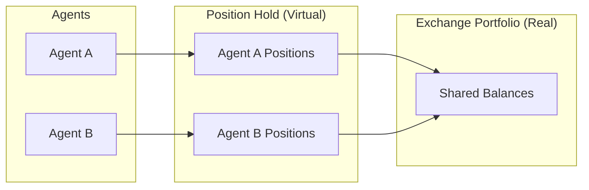
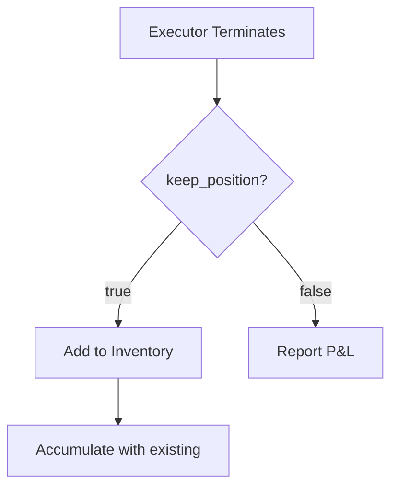

**Inventory** (also called Position Hold) is the virtual portfolio that tracks a Trading Agent's cumulative trading impact. It enables accurate P&L attribution when multiple agents share the same exchange accounts.

## Why Inventory Tracking?

When multiple agents trade on shared accounts, you need to know:
- Which agent made which trades
- Each agent's individual P&L
- Total exposure per agent

The Inventory system solves this by tracking positions per `controller_id` (agent ID).

## Position Hold

Each position is uniquely keyed by `(connector_name, trading_pair)`:



## Position Types

| Type | Connectors | Description |
|------|------------|-------------|
| **Spot** | `binance`, `coinbase`, `jupiter` | Standard buy/sell positions |
| **Perp** | `binance_perpetual`, `hyperliquid_perpetual` | Leveraged long/short positions |
| **LP** | `meteora`, `uniswap_v3` | Liquidity provider positions |

## Trading Pair Format

```
trading_pair = "SOL-USDT"
                 │    │
                 │    └── Quote Asset (USDT)
                 │        - P&L measured in this currency
                 │
                 └── Base Asset (SOL)
                     - The asset being traded
                     - Amount always in this unit
```

## Position State

Each position tracks:

| Field | Description |
|-------|-------------|
| `buy_amount_base` | Total base asset bought |
| `buy_amount_quote` | Total quote spent on buys |
| `sell_amount_base` | Total base asset sold |
| `sell_amount_quote` | Total quote received from sells |
| `cum_fees_quote` | Cumulative fees paid |

### Derived Values

**Net Amount**:
```
net = buy_amount_base - sell_amount_base
```

**Side**:
- `net > 0` → Long (BUY)
- `net < 0` → Short (SELL)
- `net = 0` → Closed

**Breakeven Price**:
```
breakeven = buy_amount_quote / buy_amount_base  (if long)
breakeven = sell_amount_quote / sell_amount_base  (if short)
```

## P&L Calculation

### Unrealized P&L

Mark-to-market value at current price:

```
Long:  unrealized_pnl = (current_price - breakeven) × amount
Short: unrealized_pnl = (breakeven - current_price) × amount
```

### Realized P&L

When positions are reduced:

```
matched = min(buy_amount_base, sell_amount_base)
realized_pnl = (avg_sell_price - avg_buy_price) × matched
```

### Global P&L

```
global_pnl = unrealized_pnl + realized_pnl - fees
```

## Executor → Position Flow

When an executor terminates:

**keep_position: true**
- Position added to Inventory
- Aggregates with existing position if same key
- No P&L attributed yet

**keep_position: false**
- Position fully closed
- Realized P&L calculated and reported
- Nothing added to Inventory



## Example

**Trade 1**: Buy 100 SOL at $150
```
Inventory: buy_amount_base=100, buy_amount_quote=15000
Position: Long 100 SOL, breakeven=$150
```

**Trade 2**: Buy 50 SOL at $145
```
Inventory: buy_amount_base=150, buy_amount_quote=22250
Position: Long 150 SOL, breakeven=$148.33
```

**Trade 3**: Sell 100 SOL at $155
```
Inventory: sell_amount_base=100, sell_amount_quote=15500
Matched: 100 SOL
Realized P&L: ($155 - $148.33) × 100 = +$667
Remaining: Long 50 SOL, breakeven=$148.33
```

## Via API

List positions for an agent:

```bash
curl -u admin:admin http://localhost:8000/executors/positions?controller_id=my-agent
```
