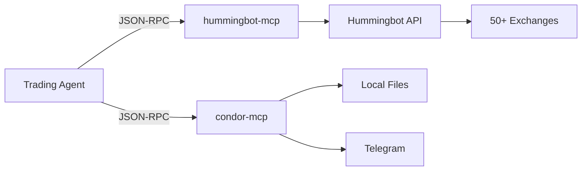

Trading Agents interact with exchanges and local operations through **MCP (Model Context Protocol)** servers. MCP provides a standardized way for LLMs to call tools via JSON-RPC 2.0.

## Architecture

Condor runs two MCP servers:

| Server | Purpose |
|--------|---------|
| **hummingbot-mcp** | Trading operations via Hummingbot API (27 tools) |
| **condor-mcp** | Local operations: notifications, routines, journals (9 tools) |



## Hummingbot MCP Tools

### Account Management

| Tool | Description |
|------|-------------|
| `setup_connector()` | Add/remove exchange API credentials |
| `configure_server()` | Switch between Hummingbot API servers |

### Portfolio & Holdings

| Tool | Description |
|------|-------------|
| `get_portfolio_overview()` | Unified view: balances, positions, LP, orders |

### Trading Operations

| Tool | Description |
|------|-------------|
| `set_account_position_mode_and_leverage()` | Configure perpetual trading settings |
| `search_history()` | Query historical orders, positions, LP |
| `get_market_data()` | Prices, candles, funding rates, order books |

### Executor Management

The primary trading interface for agents:

| Tool | Description |
|------|-------------|
| `manage_executors()` | Create, search, stop trading executors |

**Supported executor types:**
- `order_executor` - Single limit/market orders
- `position_executor` - Directional trades with triple barrier
- `grid_executor` - Multi-level grid trading
- `dca_executor` - Dollar-cost averaging
- `lp_executor` - Liquidity provision

**Actions:** `create`, `search`, `stop`, `get_logs`

### Bot Management

For advanced multi-strategy deployments:

| Tool | Description |
|------|-------------|
| `manage_bots()` | Deploy and control controller-based bots |
| `manage_controllers()` | CRUD operations on controller templates |

### Gateway (DEX Trading)

| Tool | Description |
|------|-------------|
| `explore_dex_pools()` | Discover CLMM pools with filtering |
| `manage_gateway_swaps()` | Execute DEX swaps |
| `manage_gateway_clmm()` | Manage CLMM liquidity positions |
| `manage_gateway_container()` | Control Gateway Docker container |

### Market Intelligence

| Tool | Description |
|------|-------------|
| `explore_geckoterminal()` | Free market data: networks, pools, OHLCV |

## Condor MCP Tools

### Notifications

| Tool | Description |
|------|-------------|
| `send_notification()` | Send Telegram messages (Markdown/HTML) |

### Routine Management

| Tool | Description |
|------|-------------|
| `manage_routines()` | Discover, run, create, edit routines |

### Trading Agent Operations

| Tool | Description |
|------|-------------|
| `manage_trading_agent()` | Strategy CRUD, agent lifecycle (start/stop/pause) |
| `trading_agent_journal_read()` | Read journal: recent entries, learnings, state |
| `trading_agent_journal_write()` | Write to journal: actions, learnings, state |

### Utilities

| Tool | Description |
|------|-------------|
| `manage_servers()` | List accessible API servers |
| `get_user_context()` | Current user info, active server, permissions |
| `manage_notes()` | Key-value persistent storage |

## Progressive Disclosure

Many tools support step-by-step discovery:

```
1. Call with no parameters → See available options
2. Call with partial parameters → See next steps
3. Call with all parameters → Execute action
```

**Example: Creating an executor**

```
Agent: manage_executors()
Tool: Available executor types: order_executor, position_executor, grid_executor...

Agent: manage_executors(action="create", executor_type="grid_executor")
Tool: Required fields for grid_executor:
  - connector_name (string)
  - trading_pair (string)
  - ...

Agent: manage_executors(action="create", executor_type="grid_executor", config={...})
Tool: Grid executor created (ID: exec_123)
```

## Configuration

### Server Settings

MCP servers read configuration from environment variables or `~/.hummingbot_mcp/server.yml`:

| Variable | Default | Description |
|----------|---------|-------------|
| `HUMMINGBOT_API_URL` | `http://localhost:8000` | API server URL |
| `HUMMINGBOT_USERNAME` | `admin` | API username |
| `HUMMINGBOT_PASSWORD` | `admin` | API password |
| `HUMMINGBOT_TIMEOUT` | `30.0` | Request timeout (seconds) |
| `HUMMINGBOT_MAX_RETRIES` | `3` | Retry attempts |

### Runtime Configuration

Agents can switch servers at runtime:

```
Agent: configure_server()
Tool: Current server: localhost:8000 (admin)

Agent: configure_server(url="http://prod-server:8000", username="trader", password="xxx")
Tool: Connected to prod-server:8000
```

## Error Handling

MCP servers provide contextual error messages:

- **Connection errors**: Suggests checking server URL and Docker networking
- **Auth errors**: Prompts to verify credentials via `configure_server()`
- **Validation errors**: Shows required fields and valid values

All tools use retry logic (3 attempts with 2-second delays) for transient failures.

## Running MCP Servers

MCP servers are started automatically when agents launch via ACP. For manual testing:

```bash
# Hummingbot MCP
python -m mcp_servers.hummingbot_api

# Condor MCP
python -m mcp_servers.condor
```

## Adding Custom Tools

To add tools to an MCP server, create a function with the `@mcp.tool()` decorator:

```python
# In mcp_servers/hummingbot_api/tools/custom.py

@mcp.tool()
async def my_custom_tool(param1: str, param2: int = 10) -> str:
    """
    Description of what this tool does.

    Args:
        param1: Description of param1
        param2: Description of param2 (default: 10)
    """
    # Implementation
    result = await do_something(param1, param2)
    return format_result(result)
```

Register the tool in `server.py`:

```python
from .tools.custom import my_custom_tool
```
