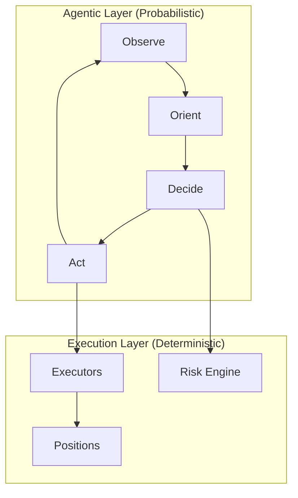

A **Trading Agent** is an autonomous, file-backed entity that runs on a fixed tick interval, reasons about the market with an LLM, and translates its decisions into real trades through Hummingbot executors.

<Frame>
  
</Frame>

## Design Philosophy

The Trading Agents Standard separates what LLMs do well—reasoning under uncertainty—from what traditional software does well—reliable, repeatable execution.



| Layer | Type | What It Does |
|-------|------|--------------|
| **Agentic** | LLM reasoning (OODA loop) | Observes market, orients context, decides action, acts via tools |
| **Execution** | Deterministic Python | Runs executors, tracks positions, enforces risk limits |

The result is an agent that *thinks* like a discretionary trader but *acts* like a systematic one, with full auditability across every tick.

## Core Principle: Executor-Based Trading

**Agents only act through Hummingbot executors.** Each agent spawns executors with its own `controller_id == agent_id`, which provides:

1. **Isolation**: Two agents on the same account never see or touch each other's executors
2. **Virtual Portfolio**: Each agent gets its own positions, breakeven prices, realized/unrealized P&L
3. **Position Handover**: When an executor closes with `keep_position=true`, the agent retains the inventory

## Mental Model

> An agent is a *folder* on disk and a *tick loop* in memory. The folder is its long-term memory; providers give it short-term situational awareness; the LLM is its decision function; executors are its hands; the risk engine is the wrist it can't move past.

Everything an agent owns is tagged with its `controller_id`, making the system safely composable: any number of agents can share the same exchange account without stepping on each other.

## Core Components

| Component | Purpose | Documentation |
|-----------|---------|---------------|
| [Architecture](/trading-agents/architecture) | File structure, tick engine, providers | agent.md, journals, learnings |
| [Sessions](/trading-agents/sessions) | Session management, snapshots | Cross-session memory |
| [Inventory](/trading-agents/inventory) | Position tracking and P&L | Virtual portfolio |
| [Executors](/executors/overview) | Trading operations | Types, lifecycle, keep_position |
| [MCP Tools](/trading-agents/mcp-tools) | LLM tool access | Market data, trading |

## Run Modes

| Mode | Behavior |
|------|----------|
| `dry_run` | One tick, no trading. Pure reasoning test. Saves experiment snapshot. |
| `run_once` | One tick with trading. Manual single-shot execution. |
| `loop` | Standard mode. Ticks every `frequency_sec` until stopped. Creates session with full journal. |

## Quick Start

**Via Telegram**:
```
/agent → Create New Agent → Configure → Start
```

**Programmatically**:
```python
from condor.trading_agent.engine import TickEngine
from condor.trading_agent.strategy import StrategyStore

store = StrategyStore()
strategy = store.get_by_slug("my_strategy")

engine = TickEngine(
    strategy=strategy,
    config={
        "execution_mode": "loop",
        "frequency_sec": 60,
        "server_name": "binance_main",
        "total_amount_quote": 500,
        "risk_limits": {
            "max_total_exposure_quote": 1500,
            "max_drawdown_pct": 5,
            "max_open_executors": 4,
        },
    },
)

await engine.start()
```

## Session Continuity

The `~/condor` directory stores all agent state, and Condor uses ACP (Agent Communication Protocol) to connect to your LLM.

This means you can:
- Start a conversation on Telegram
- Continue it in Claude Code
- Switch to the web dashboard

Same session, same agent state, same conversation history.
