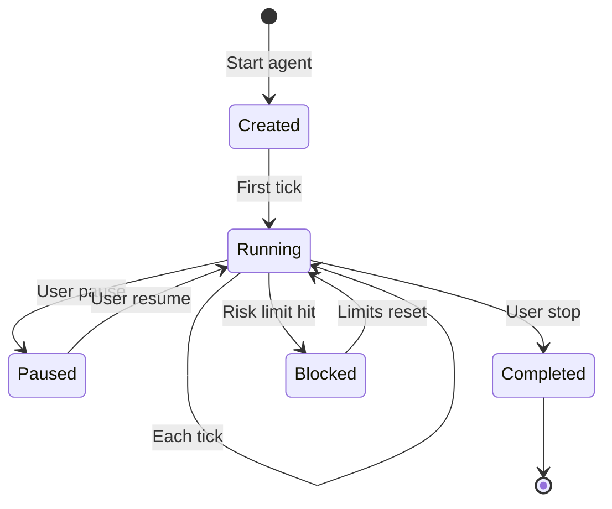

Each time you start a Trading Agent, it creates a new **session** that tracks all activity, decisions, and state changes.

## Session Structure

Sessions are stored in the agent's `trading_sessions/` directory:

```
trading_agents/my-strategy/
└── trading_sessions/
    ├── session_1/
    │   ├── journal.md
    │   └── snapshots/
    ├── session_2/
    │   ├── journal.md
    │   └── snapshots/
    └── session_3/
        ├── journal.md
        └── snapshots/
```

## journal.md

The journal is the agent's working memory for the session. It contains:

### Summary Section

High-level overview updated each tick:

```markdown
## Summary

- **Session Start**: 2026-03-27 14:00 UTC
- **Current Tick**: 47
- **Active Executors**: 2
- **Session P&L**: +$127.50
- **Status**: Running
```

### Decisions Section

Key decisions made during the session:

```markdown
## Decisions

### Tick 45 - 2026-03-27 15:32 UTC
**Decision**: Open long position on SOL-USDT
**Reasoning**: Price broke above 20-period high with increasing volume
**Action**: Created PositionExecutor (ID: exec_045)

### Tick 38 - 2026-03-27 15:10 UTC
**Decision**: Close grid executor
**Reasoning**: Volatility exceeded threshold, grid levels too tight
**Action**: Stopped GridExecutor (ID: exec_032)
```

### Ticks Section

Record of each OODA loop iteration:

```markdown
## Ticks

### Tick 47 - 2026-03-27 15:35 UTC
- **Portfolio Value**: $10,127.50
- **Open Positions**: 1 (SOL-USDT long 10 @ 152.30)
- **Active Executors**: 2
- **Market Context**: SOL +2.3% 1h, funding 0.01%
- **Action Taken**: Monitoring, no changes
```

### Executors Section

Active and completed executor states:

```markdown
## Executors

### Active
| ID | Type | Pair | Side | Entry | Current | P&L |
|----|------|------|------|-------|---------|-----|
| exec_045 | Position | SOL-USDT | BUY | 152.30 | 154.10 | +$18.00 |

### Completed This Session
| ID | Type | Close Type | P&L | Duration |
|----|------|------------|-----|----------|
| exec_032 | Grid | EARLY_STOP | +$45.20 | 2h 15m |
```

## snapshots/

Full tick snapshots for debugging and replay. This is one of the most important parts of the system: **observability**.

Each snapshot captures the complete state of a tick:

```json
{
  "tick": 47,
  "timestamp": "2026-03-27T15:35:00Z",
  "system_prompt": "...",
  "agent_response": {
    "text": "Trend flip bullish. All conditions met, opening long.",
    "decision": "create_executor",
    "reasoning": "Price within 2% of S1, EMAs aligned bullish"
  },
  "tool_calls": [
    {"tool": "run_routine", "args": {...}, "result": {...}},
    {"tool": "create_executor", "args": {...}, "result": {...}}
  ],
  "portfolio": {
    "total_value_quote": 10127.50,
    "positions": [...],
    "balances": {...}
  },
  "market_data": {
    "SOL-USDT": {
      "price": 154.10,
      "volume_24h": 1250000000,
      "funding_rate": 0.0001
    }
  },
  "executors": [...],
  "risk_state": {
    "daily_pnl": 127.50,
    "total_exposure": 1541.00,
    "is_blocked": false
  }
}
```

This lets you:
- **Debug** exactly what the agent was thinking when it made a decision
- **Understand** why a trade was placed or not placed
- **Replay** the prompt that was passed to the agent
- **Audit** all reasoning and tool calls

**Retention**: Maximum 100 snapshots per session. Older snapshots are pruned automatically.

## Session Continuity

The `~/condor` directory stores all agent state. Combined with ACP (Agent Client Protocol), this enables seamless continuity across interfaces:

| Interface | How to Connect |
|-----------|---------------|
| **Telegram** | `/agent` → Select agent → Resume session |
| **Claude Code** | `claude --agent ~/condor/trading_agents/my-strategy` |
| **Web Dashboard** | Select agent from dashboard (coming soon) |

When you switch interfaces:
- Same session continues
- Full conversation history preserved
- Agent state unchanged

## Starting a New Session

To start a fresh session instead of resuming:

**Telegram**: `/agent` → Select agent → **New Session**

**CLI**:
```bash
claude --agent ~/condor/trading_agents/my-strategy --new-session
```

## Injecting Directives

You can send real-time instructions to a running agent using **directives**. The directive will be included in the agent's next tick prompt under a `USER DIRECTIVES` section, then cleared.

**Telegram**: `/agent` → Select running agent → **Inject Directive**

**Programmatic**:
```python
engine.inject_directive("Reduce exposure, news event in 10 min.")
```

Common directive use cases:
- Alert the agent to upcoming news events
- Request exposure reduction before volatility
- Override normal behavior temporarily
- Provide market context the agent can't observe

The agent sees the directive verbatim and decides how to act on it based on its strategy rules.

## Session Lifecycle


